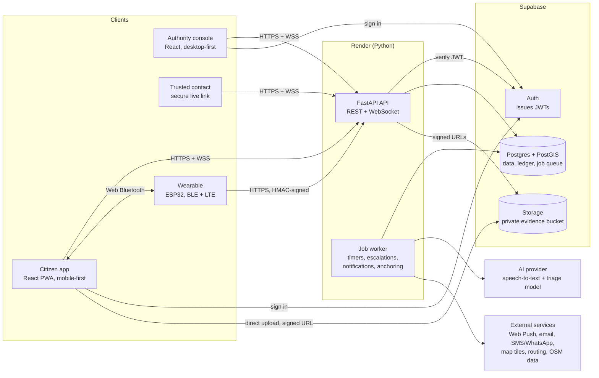
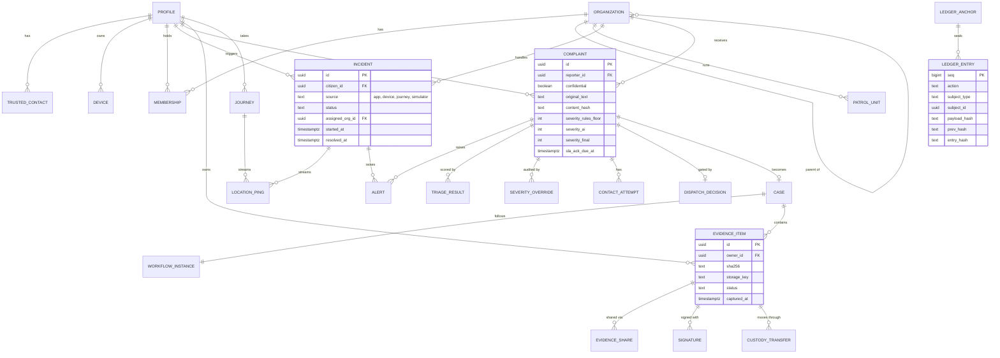
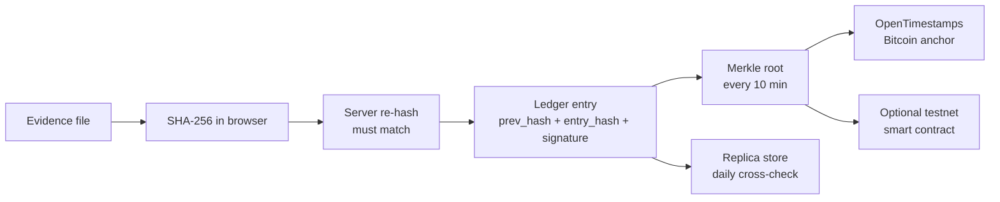
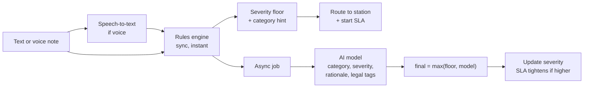
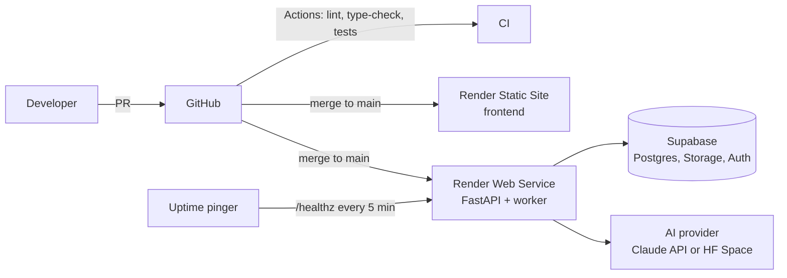

# 02 · System Architecture

> How the platform is built. The module IDs (M1–M14) come from [01-product.md](01-product.md).
> Step-by-step flows are in [03-workflows.md](03-workflows.md). Build order is in [04-roadmap.md](04-roadmap.md).

---

## 1. At a glance

**Style:** a *modular monolith*. One FastAPI application contains every module, with a durable job worker in the same process. A separate AI model service is optional. The React PWA talks to the API over REST and WebSockets. Postgres (with PostGIS) holds all data, the ledger and the job queue. Evidence files live in private object storage.

**Why a modular monolith:**

- A small team ships one deployable, which fits free-tier hosting.
- A single database transaction can **write the record, append the ledger entry and enqueue the follow-up job** together. That atomicity is the heart of the accountability promise.
- Module boundaries are strict (one folder per module, no reaching into another module's tables), so notifications or AI can be split out later without a rewrite.



---

## 2. Hosting: Render or Hugging Face?

The brief said "Render or Hugging Face, whichever works". Free tiers as of **October 2026**:

| | Render (free web service) | Hugging Face Spaces |
|---|---|---|
| Host a Python API | ✅ Free | ❌ Since July 2026, new Docker Spaces need a paid PRO plan ($9/month). Free accounts can host up to 2 Gradio Spaces on ZeroGPU only. |
| Sleep behaviour | Spins down after 15 min without traffic. Waking takes about 1 min. | Not applicable on the free plan. |
| Good for | The main API and worker | ML models: Whisper and a classifier on a ZeroGPU Gradio Space (free quota: 5 GPU-minutes/day) |

**Decision:** the **Python backend runs on Render**. Hugging Face becomes an *optional model host* that the backend calls (see §9). Docker Spaces created before July 2026 keep working, so a team that already has one, or pays for PRO, could host there. Render is still the simpler default.

> **Open alternative (decision D1):** run the backend on **Supabase Edge Functions** instead of Render. They answer without Render's one-minute cold start and Supabase adds realtime and cron, but they run TypeScript (Deno), not Python, with 2 s of CPU and 150 s of wall-clock time per request on the free plan. See [04-roadmap.md §4](04-roadmap.md#4-decisions).

**Free-tier caveats and how we handle them:**

| Caveat | Mitigation |
|---|---|
| Render cold start of about 1 min, which is unacceptable for a real SOS | For demos, an uptime pinger hits `/healthz` every 5 min. One always-awake service fits in Render's 750 free instance-hours/month. For a pilot, switch to an always-on paid instance. |
| Render's free Postgres expires after 30 days | Use **Supabase** Postgres instead: 500 MB database, 1 GB file storage, 50k monthly active users on the free plan. Free projects pause after 1 week without activity, so keep the project active or upgrade. |
| Background workers are not part of the free tier | The worker runs **inside the API process**. Jobs are stored in Postgres, so a restart or sleep never loses a timer: overdue jobs run on wake. Split into a separate worker service once on a paid plan. |

---

## 3. Tech stack

| Layer | Choice | Notes |
|---|---|---|
| **Frontend** | React 19 + TypeScript (strict) + Vite | SPA plus PWA (`vite-plugin-pwa`). |
| UI | **shadcn/ui** + Tailwind CSS v4 + lucide icons | Shared components in `components/ui`. Severity color tokens. Dark mode. |
| Routing | **React Router** (data mode, `createBrowserRouter`) | Dynamic segments, nested layouts per role, lazy-loaded route modules (§13). |
| Server state | TanStack Query | Caching, retries, optimistic updates. Realtime events patch the cache. |
| Forms | react-hook-form + zod | The shadcn `Form` pattern. |
| API types | `openapi-typescript` + `openapi-fetch` | Types are generated from FastAPI's OpenAPI schema. No hand-copied DTOs. |
| Maps | MapLibre GL (`react-map-gl`) + OpenFreeMap tiles + `h3-js` | Free vector tiles. Risk heatmap drawn as H3 hexagons. |
| **Backend** | Python 3.12, **FastAPI**, Pydantic v2 | Async throughout. OpenAPI docs at `/docs`. |
| Schema & migrations | **SQL migrations in `supabase/migrations`** (Supabase CLI layout) | One schema source whichever backend runtime wins decision D1. Rules that must never be skipped (ledger, roles) live in Postgres itself. |
| Tooling | `uv`, ruff, mypy, pytest | |
| **Database** | Supabase Postgres + PostGIS | Spatial queries: nearest station, jurisdiction, route buffers. |
| Files | Supabase Storage (private bucket) | Browser uploads directly with short-lived signed URLs. |
| Auth | **Supabase Auth** for people. **HMAC keys** for wearables. **WebAuthn passkeys** for step-up. | FastAPI verifies Supabase JWTs. Roles live in our own tables. |
| Jobs & timers | Postgres-backed durable queue (for example Procrastinate, or a small `jobs` table using `FOR UPDATE SKIP LOCKED`) | No Redis needed. |
| Realtime | FastAPI WebSockets with a topic hub | Add Postgres `LISTEN/NOTIFY` fan-out when running more than one instance. |
| Notifications | Web Push (VAPID), email (an HTTP API such as Resend), SMS/WhatsApp (Twilio or Meta Cloud API), optional Telegram bot | Pluggable channel adapters (§8). |
| Geo data | OpenStreetMap, Overpass API (safe points), OpenRouteService (walking routes), Nominatim (geocoding), Uber H3 (risk grid) | |
| AI | Rules engine (always on) + Whisper speech-to-text + a triage model (Claude API or an HF ZeroGPU Space) | §9 |
| **Hosting** | Render (API), Render Static Site or Vercel (frontend), Supabase (DB, files, auth) | §2, §15 |
| CI/CD | GitHub Actions | Lint, type-check and tests on every PR. Auto-deploy on merge to `main`. |

---

## 4. Backend modules

| Module | Responsibility | Main tables | Product IDs |
|---|---|---|---|
| `identity` | Profiles, roles, organizations, memberships, jurisdictions, passkeys | `profiles`, `organizations`, `memberships`, `passkeys` | all |
| `circle` | Trusted contacts and invitations | `trusted_contacts` | M1 |
| `devices` | Wearable registry, HMAC auth, heartbeat, tamper, simulator | `devices`, `device_events` | M13 |
| `sos` | Incidents, triggers, location stream, live links, resolve, cancel, duress | `incidents`, `location_pings`, `share_links` | M2, M3 |
| `dispatch` | Choosing responders, alerts, acknowledgements, escalation ladders, SLA timers | `alerts`, `escalation_policies` | M4 |
| `notify` | Channel adapters, templates, delivery receipts, push subscriptions | `notifications`, `push_subscriptions` | M4 |
| `complaints` | Intake, confidential mode, routing, lifecycle | `complaints`, `reporter_identities` | M6 |
| `triage` | Rules engine, AI provider adapters, severity rubric, legal tags | `triage_results`, `legal_tag_map` | M6, M7 |
| `authority` | Queue, Call & Connect, dispatch gate, patrol units, overrides, FIR drafts | `contact_attempts`, `dispatch_decisions`, `severity_overrides`, `patrol_units`, `fir_drafts` | M5, M7, M8 |
| `vault` | Evidence items, upload and verification, sharing, delayed deletion | `evidence_items`, `evidence_shares` | M9 |
| `custody` | Cases, procedural workflows, signatures, custody transfers, geofence checks | `cases`, `workflow_definitions`, `workflow_instances`, `signatures`, `custody_transfers` | M10 |
| `ledger` | Append-only hash chain, anchoring, verification | `ledger_entries`, `ledger_anchors` | all |
| `geo` | Safe points, zone reports, risk cells, safe routing | `safe_points`, `zone_reports`, `risk_cells` | M11 |
| `journeys` | Active monitoring, heartbeat, deviation and stop detection | `journeys` | M11 |
| `oversight` | Anomaly rules and models, review queue, weekly reports | `anomalies` | M14 |
| `fakecall` | Caller profiles and scripts | `fake_call_profiles` | M12 |

**Module rules**

1. A module owns its tables. Other modules call its `service` functions and never touch its tables directly.
2. Side effects (sending an alert, scheduling an escalation) go through **durable jobs**, never fire-and-forget tasks.
3. Every meaningful state change calls `ledger.append(...)` **in the same transaction** as the change itself.
4. Business time comes from an injectable `Clock`, so escalation and SLA logic can be tested with time travel.

**Code layout**

```text
backend/
  app/
    main.py              # app factory: routers, middleware, lifespan (starts the worker)
    core/                # config, db session, auth (JWT + RBAC), errors, idempotency, clock
    ledger/              # platform service: append, verify, anchor
    jobs/                # durable queue, scheduler, handler registry
    realtime/            # WebSocket hub and topics
    modules/
      sos/
        router.py        # HTTP endpoints
        schemas.py       # Pydantic request/response models
        models.py        # SQLAlchemy tables
        service.py       # business logic: transaction + ledger + jobs
        jobs.py          # job handlers owned by this module
      circle/ dispatch/ notify/ complaints/ triage/ authority/
      vault/ custody/ geo/ journeys/ devices/ oversight/ fakecall/ identity/
  # schema lives in supabase/migrations (SQL), shared by every runtime
  tests/
  pyproject.toml
ai-service/              # optional model service (HF ZeroGPU Gradio Space)
```

---

## 5. Data model

Conventions:

- Time-ordered UUID primary keys, generated in the app.
- `timestamptz` in UTC everywhere.
- PostGIS `geography(Point, 4326)` for locations.
- `jsonb` for flexible payloads. Status values are text with check constraints.
- No hard deletes on case data: status changes plus ledger entries instead.

### 5.1 Core entities



### 5.2 Tables by module

| Module | Table | Key columns |
|---|---|---|
| identity | `profiles` | `id` (= auth user id), `full_name`, `phone`, `role`, `sos_pin_hash`, `duress_pin_hash`, `locale` |
| | `organizations` | `id`, `name`, `type` (police_station, campus_security, control_room), `parent_id`, `jurisdiction` (multipolygon), `location` |
| | `memberships` | `user_id`, `org_id`, `role` (officer, supervisor, dispatcher), `on_duty`, `badge_no` |
| | `passkeys` | `user_id`, `credential_id`, `public_key`, `sign_count` |
| circle | `trusted_contacts` | `owner_id`, `name`, `phone`, `email`, `contact_user_id?`, `priority`, `channels`, `status` |
| devices | `devices` | `owner_id`, `kind`, `hw_id`, `secret_enc`, `battery_pct`, `last_seen_at`, `status` (active, tamper, lost) |
| | `device_events` | `device_id`, `type` (heartbeat, gesture, tamper, battery_low, sos), `payload`, `at` |
| sos | `incidents` | see diagram, plus `last_location`, `resolution_code` |
| | `location_pings` | `subject_type` (incident, journey, unit), `subject_id`, `at`, `point`, `accuracy_m`, `speed`, `battery` |
| | `share_links` | `incident_id`, `token_hash`, `contact_id`, `expires_at`, `acked_at` |
| dispatch | `alerts` | `subject_type`, `subject_id`, `recipient_type`, `recipient_id`, `level`, `channel`, `status`, `sent_at`, `acked_at` |
| | `escalation_policies` | `org_id?`, `subject_type`, `levels` (jsonb: targets, channels, timeout per level) |
| complaints | `complaints` | see diagram, plus `transcript`, `language`, `location`, `occurred_at`, `routed_org_id`, `category_ai`, `category_final`, `status` |
| | `reporter_identities` | `complaint_id`, encrypted identity fields (confidential mode) |
| triage | `triage_results` | `complaint_id`, `provider`, `model`, `version`, `output` (jsonb), `created_at` |
| | `legal_tag_map` | `category`, `code_system` (e.g. BNS), `section`, `label`, `reviewed_by` |
| authority | `severity_overrides` | `complaint_id`, `officer_id`, `from_level`, `to_level`, `reason_code`, `justification`, `review_status` |
| | `contact_attempts` | `complaint_id`, `officer_id`, `channel`, `started_at`, `connected_at`, `ended_at`, `outcome` |
| | `dispatch_decisions` | `complaint_id`, `visit_required`, `reason_code`, `unit_id`, `decided_at` |
| | `patrol_units` | `org_id`, `call_sign`, `status`, `last_location`, `last_seen_at` |
| | `fir_drafts` | `complaint_id`, `version`, `content` (jsonb), `content_hash`, `pdf_item_id`, `status` |
| vault | `evidence_items` | see diagram, plus `kind`, `mime`, `size`, `capture_location`, `uploaded_at`, `locked_at`, `replica_key` |
| | `evidence_shares` | `item_id`, `org_id`, `subject_type`, `subject_id`, `granted_at`, `withdrawal_requested_at` |
| custody | `cases` | `complaint_id`, `org_id`, `scene_location`, `scene_radius_m`, `io_id`, `supervisor_id`, `status` |
| | `workflow_definitions` | `key`, `version`, `definition` (jsonb: states, transitions, requirements), `active` |
| | `workflow_instances` | `definition_id`, `subject_type`, `subject_id`, `current_state` |
| | `signatures` | `subject_type`, `subject_id`, `signer_id`, `purpose`, `payload_hash`, `method` (webauthn, ed25519), `signature` |
| | `custody_transfers` | `item_id`, `from_party`, `to_party`, `location`, `purpose`, `initiated_at`, `accepted_at`, `verified_hash`, `status` |
| ledger | `ledger_entries` | `seq`, `occurred_at`, `recorded_at`, `actor_id`, `actor_role`, `device_id`, `action`, `subject_type`, `subject_id`, `lat`, `lng`, `accuracy_m`, `payload`, `payload_hash`, `prev_hash`, `entry_hash` |
| | `ledger_anchors` | `from_seq`, `to_seq`, `merkle_root`, `method` (ots, evm, replica), `receipt`, `anchored_at` |
| geo | `safe_points` | `name`, `category`, `point`, `source` (osm, admin), `verified`, `open_hours` |
| | `zone_reports` | `reporter_id`, `point`, `h3_cell`, `type` (poor_lighting, isolated, harassment, no_transport), `at`, `status` |
| | `risk_cells` | `h3_cell`, `score_day`, `score_night`, `factors`, `sample_count`, `updated_at` |
| journeys | `journeys` | `user_id`, `origin`, `destination`, `route` (linestring), `eta`, `status`, `monitoring_level`, `last_ping_at` |
| oversight | `anomalies` | `type`, `severity`, `subject_type`, `subject_id`, `actor_id`, `details`, `status`, `reviewed_by` |
| fakecall | `fake_call_profiles` | `user_id`, `caller_name`, `voice`, `script` (jsonb) |
| platform | `jobs` | `kind`, `run_at`, `payload`, `status`, `attempts`, `locked_at`, `last_error` |

---

## 6. Integrity ledger (the "blockchain" layer)

This one service powers the incident timeline (I1#15, I2§4), evidence hashing (I1#10), the immutable audit log, chain of custody and the anti-suppression promise (I2§2, I2§3).

**What gets recorded:** every meaningful action. Examples: SOS triggered, alert sent, alert acknowledged, escalated, severity overridden, evidence registered, sealed, viewed, signed or transferred, workflow step completed, FIR draft version saved.
Individual GPS pings are **not** recorded one by one. Each minute of pings becomes a single entry holding the hash of that batch.

**Entry format:** `WHO → WHAT → WHEN → WHERE → HASH` (I2):

| Field | Meaning |
|---|---|
| `seq` | Position in the chain |
| `actor_id`, `actor_role`, `device_id` | Who did it, and from which device |
| `action`, `subject_type`, `subject_id` | What happened, and to what |
| `occurred_at`, `recorded_at` | When it happened, and when the server stored it |
| `lat`, `lng`, `accuracy_m` | Where (when known) |
| `payload_hash` | SHA-256 of the payload's `jsonb` text (for example the evidence file hash plus metadata) |
| `prev_hash` | `entry_hash` of the previous entry |
| `entry_hash` | SHA-256 over all fields above joined with `\|`, timestamps in UTC with microseconds (`ledger_entry_material()`) |

A platform signature over each `entry_hash` (Ed25519) is planned for Phase 4, alongside officer signatures.

**How tampering is prevented and detected:**

1. **Append-only, enforced by Postgres** (`supabase/migrations/*_ledger.sql`). A `BEFORE INSERT` trigger assigns `seq`, `recorded_at` and both hashes under an advisory lock, so callers cannot choose them. Triggers reject `UPDATE`, `DELETE` and `TRUNCATE`, even from the service role. Browsers cannot write at all: entries come from `ledger_append()`, which takes the actor from the session, called by domain functions or the backend. Corrections are new entries that reference the original (I2: "append a new corrective event").
2. **Hash chain.** Changing any past entry breaks every later `prev_hash` link. `ledger_verify()` recomputes every hash and reports the first broken entry; a nightly job runs it.
3. **Anchoring.** Every 10 minutes the worker computes a Merkle root over the new entries and publishes **only that root**, never personal data, to outside witnesses:
   - **OpenTimestamps**: free, and anchors into the Bitcoin blockchain.
   - Optional for the demo: a tiny smart contract on a public EVM testnet (for example Polygon Amoy).
4. **Replication (anti-suppression).** Evidence files and ledger heads are copied to a second, independently controlled store, standing in for the "institutional server". A daily job cross-checks hashes, and a mismatch opens an anomaly.
5. **Public verification.** On `/verify` anyone can drop a file. The browser hashes it locally (the file never leaves the device). The API returns when the file was registered, its ledger position, a Merkle proof and the anchor receipt.



**Honest framing** (I2 design note): the ledger proves *what was recorded, by whom, and when*, and that it has not changed since. It **does not decide legal compliance**. Admissibility of electronic evidence has to be confirmed with legal advisors.

---

## 7. Escalation & SLA engine (dead-man switch)

A single engine serves SOS escalation (I1#6, I2§3) and complaint SLAs (I3-A§1).

**Policy = data.** An ordered list of levels. Each level names its targets, channels and timeout. Policies are stored per organization in `escalation_policies`.

**Default SOS ladder** (configurable):

| Level | When | Who | Channels |
|---|---|---|---|
| L0 | Immediately | All trusted contacts, plus duty officers of the responsible station | Console, push, email/SMS live link |
| L1 | No acknowledgement after 2 min | Station supervisor, plus a contact reminder | Push, SMS/WhatsApp |
| L2 | No acknowledgement after 5 min | Parent organization (district control room). Flashing red. | Console, push, SMS |
| L2+ | Every 2 min afterwards | Repeat L2 and notify oversight | |

**Default complaint SLA** (time to acknowledge, by severity; configurable per organization):

| Severity | L5 Critical | L4 High | L3 Elevated | L2 Moderate | L1 Low |
|---|---|---|---|---|---|
| Acknowledge within | **3 min** | 10 min | 20 min | **30 min** | 4 h |

I3 fixes L5 at 3 min and L2 at 30 min. The other values are proposed defaults.

**Mechanics**

1. When an alert is created, schedule a durable job `escalation.check(subject, level)` to run at `now + timeout`.
2. An acknowledgement marks the subject as acknowledged. The pending job then becomes a no-op when it fires.
3. When the job fires and the subject is still unacknowledged: append an `escalated` ledger entry, notify the next level, schedule the next check.
4. Handlers are idempotent, so running one twice is harmless. Time comes from the injectable clock.

**Golden-hour metrics** per incident: time to first acknowledgement, time to dispatch, time to arrival. They are shown on the console and in weekly oversight reports.

---

## 8. Realtime & notifications

**Realtime**

- WebSocket endpoint: `/ws?ticket=…`. Browsers cannot set auth headers on WebSockets, so the client first fetches a 60-second ticket from `POST /api/v1/realtime/ticket`.
- Topics: `incident:{id}`, `journey:{id}`, `org:{id}:live`, `org:{id}:queue`, `user:{id}`.
- Location goes up over **REST** (`POST /incidents/{id}/locations`, batched), so it still works when the socket drops. The server fans it out over WebSockets.
- Trusted-contact live link `/t/:token`: 128-bit random token, stored hashed, read-only plus "I'm responding", expires 24 h after the incident closes.

**Notification channels** share one adapter interface, `send(recipient, message) → receipt`.

| Order | Channel | Cost | Notes |
|---|---|---|---|
| 1 | In-app (WebSocket) | Free | Instant while the app is open |
| 2 | Web Push (VAPID) | Free | iOS requires the PWA to be installed |
| 3 | Email (Resend or Brevo API) | Free tier | Carries the live link |
| 4 | Telegram bot | Free | Good fallback for demos |
| 5 | SMS / WhatsApp (Twilio, Meta Cloud API) | Paid, or sandbox for testing | In India, commercial SMS needs DLT template registration and WhatsApp needs Meta business approval. Use sandboxes for the demo. |

A delivery that fails or stays unacknowledged moves to the next channel. Every attempt is stored in `alerts`.

---

## 9. AI components

### 9.1 Complaint triage (M6, M7)



- **Rules engine** (always on, inside the API): an English, Hindi and Hinglish phrase lexicon plus patterns such as a weapon mentioned, an ongoing situation ("following me right now"), injury words or night time. It produces a **severity floor** and a category hint in under 50 ms. It is deterministic, explainable and works when the AI is down.
- **AI model** (pluggable and asynchronous; it never blocks the citizen). Two adapters:

  | Adapter | What | Cost | Trade-off |
  |---|---|---|---|
  | **A. Claude API** | `claude-opus-5-5` at **low effort** (a classification route). Schema-constrained JSON through structured outputs (Python SDK: `client.messages.parse(..., output_format=TriageResult)` with a Pydantic model). | Paid per call | Best with Hinglish and mixed-language text. Returns a readable rationale. Handle the `refusal` stop reason by keeping the rules result. |
  | **B. HF ZeroGPU Space** | Gradio Space running Whisper plus a multilingual zero-shot classifier, called with `gradio_client` | Free (5 GPU-min/day) | Can queue or cold-start. Weaker on romanized Hindi. |

- **Combining rule:** `final_ai_severity = max(rules_floor, model_severity)`. The model can raise severity but never lower it below the rules floor.
- **Output contract** (versioned):

  ```json
  {
    "category": "stalking",
    "severity": 4,
    "confidence": 0.86,
    "signals": ["being_followed", "night", "isolated_location"],
    "rationale": "Reporter says a man has followed her from the metro for 10 minutes and she is alone.",
    "legal_tags": ["BNS:stalking"],
    "provider": "claude",
    "model": "claude-opus-5-5",
    "rules_floor": 4,
    "version": "triage-v1"
  }
  ```

- **Severity rubric** (configurable):

  | Level | Meaning | Examples |
  |---|---|---|
  | **L5 Critical** | Immediate danger to life or body | Weapon, ongoing assault, abduction, "help me now", linked to an active SOS |
  | **L4 High** | Threat in progress | Being followed right now, harassment with threats, ongoing domestic violence |
  | **L3 Elevated** | Incident just happened or risk nearby | Groping just occurred, suspicious group nearby, doxxing |
  | **L2 Moderate** | Past incident | Yesterday's verbal harassment, persistent unwanted messages |
  | **L1 Low** | General concern | Poor street lighting, nuisance |

- **Legal tags:** a `legal_tag_map` table maps categories to candidate penal-code sections (for example under the Bharatiya Nyaya Sanhita). A legal reviewer maintains it, and officers see the tags only as **suggestions**.

### 9.2 Speech-to-text

- **In the browser:** live dictation through the Web Speech API (Chrome/Android, `en-IN` / `hi-IN`). Text appears instantly at no cost.
- **On the server:** Whisper (adapter B, or another STT provider) produces the authoritative transcript of the stored voice note.
- The **original audio is always kept as sealed evidence**, so the citizen's exact words are preserved (I3-A§4).

### 9.3 Anomaly detection (M14)

- **Rules first:** expected-sequence checks (Capture → Hash → Sign → Seal), a missing custody event, a late upload (`uploaded_at` much later than `captured_at`), a GPS mismatch against the scene geofence, access by someone outside the case team, repeated failed logins, an officer's override rate.
- **Then statistics:** z-scores and an Isolation Forest on access and override patterns.
- **Output:** records in `anomalies`, sent to a supervisor or oversight review queue. AI flags; people decide (I2§5).

---

## 10. Geo: unsafe zones, safe points, safe routes, journeys

- **Risk cells.** The map is divided into H3 hexagons (resolution 9, about 0.1 km² each). Inputs:
  - complaints and SOS events, weighted by severity and fading over time;
  - citizens' zone reports (poor lighting, isolated, harassment hotspot);
  - OpenStreetMap streets tagged `lit=no`;
  - positive signals that lower risk: safe points and open businesses nearby.

  Day and night scores are computed separately by an hourly job. Each cell stores its top factors, so the map can explain *why* an area is red.
- **Privacy.** Only aggregated cells are shown, and only when a cell has at least *k* signals (default 3). The map never shows individual incident pins.
- **Safe points.** Imported from OpenStreetMap through Overpass (police, hospitals, pharmacies, transit stations, fuel stations). Admin-verified "safe havens" are added on top (campus security desks, partner shops).
- **Safe route.** Ask OpenRouteService for up to 3 walking alternatives. Score each one by risk exposure: the sum of cell risk along the path, weighted by time of day. Show **Safest** and **Fastest** with the time difference and the safe points along the way. If every option crosses a high-risk cell, retry with `avoid_polygons` around the worst cells (free-key limits: polygons up to 200 km², routes up to 150 km).
- **Journey monitoring.** The phone pings every 15 s, or every 5 s in high-risk cells at night. The server checks four conditions:
  - deviation of more than 150 m from the route for 60 s;
  - stopped for more than 3 min, away from a safe point or the destination;
  - no ping for 45 s;
  - entering a high-risk cell at night, which switches on active monitoring.

  The response is graded: an "Are you OK?" check-in → contacts alerted with the live link → an automatic SOS ([03-workflows.md](03-workflows.md#11-journey-monitoring)).

---

## 11. Evidence vault & custody

**Upload path**

1. The browser computes SHA-256: Web Crypto for small files, the streaming `hash-wasm` library for large videos.
2. `POST /vault/items` sends the hash, size, type, capture time and GPS. The API answers with a signed upload URL.
3. The browser uploads directly to the private bucket, so large files never pass through the small API instance.
4. `POST /vault/items/{id}/complete`. The worker re-hashes the stored file. A match marks the item **Sealed** and adds a ledger entry. A mismatch rejects it and opens an anomaly.

**Protection**

| Concern | Design |
|---|---|
| Confidentiality | TLS in transit. The storage provider encrypts at rest. In Phase 4 we add app-level **AES-256-GCM envelope encryption** (a per-file key wrapped by a server master key). Later option: end-to-end mode with user-held keys, shared with officers by public-key wrapping. |
| "Biometric" unlock | A **WebAuthn passkey** (Face ID or fingerprint) unlocks the vault. This is the web equivalent of I3-C§2. |
| Attacker deletes evidence | Before sharing, the owner can delete, but only with a passkey, a 30-day recovery window and an email notice. After sharing, items cannot be deleted; a withdrawal request is logged instead. |
| Phone snatched mid-recording | Stealth and emergency recordings upload in 10-second chunks. Each chunk is hashed and sealed as soon as it arrives. |
| Retention | Emergency audio follows configurable retention limits (I1#9, I2§1), except when it is attached to a case (legal hold). |

**Custody (authority side)**

- A **case** follows a configurable procedural workflow (I2§2). Each **evidence item** moves through Registered → Sealed → Locked (2 signatures) → custody transfers → Submitted ([03-workflows.md](03-workflows.md#9-case-procedural-workflow)).
- **Signatures.** In the Phase 4 MVP each officer has a server-held Ed25519 key that is used only after passkey step-up. Upgrade path: WebAuthn assertions whose challenge is the payload hash, bound to the officer's device and non-repudiable.
- **Transfers** are two-party handshakes. The sender initiates and signs. The receiver accepts and signs. The system re-hashes the file at acceptance.

---

## 12. Security & privacy

- **Roles:** citizen, contact (link scope), officer, supervisor, oversight, admin, device.
- **Row-level rules:** officers see only items routed to their organization; supervisors see their organization and its children; citizens see only their own data. Enforced in the service layer and covered by tests.
- **Confidential mode:** identity is stored separately and encrypted. Officers see a pseudonym ("Citizen #A7F3"). Contact happens through in-app channels, so no phone number is exposed. Revealing the identity needs the citizen's consent, and every reveal is ledgered.
- **Data minimization:** location is collected only during an SOS or journey. Raw pings are deleted after 30 days unless attached to a case. Emergency audio follows retention limits.
- **Every evidence view or download is a ledger entry.** These entries feed anomaly detection.
- **Secrets** live in the Render and Supabase dashboards, never in git, with separate keys per environment.
- **Abuse controls:** rate limits everywhere except the owner's own SOS creation (which is idempotent instead), false-alarm codes, verified sign-up.
- **Compliance considerations (India):** the Digital Personal Data Protection Act, 2023 (consent, purpose limitation, erasure requests against legal hold) and electronic-evidence certificate requirements under the Bharatiya Sakshya Adhiniyam, 2023. Both need to be validated with legal advisors before any pilot.

---

## 13. Frontend architecture

### 13.1 Route map (dynamic routing)

Each area is a lazy-loaded route tree with its own layout and role guard. Citizens never download console code.

| Area | Path | Screen |
|---|---|---|
| **Public** | `/` | Landing |
| | `/login`, `/signup`, `/auth/callback` | Auth |
| | `/t/:token` | Trusted-contact live view (no login) |
| | `/verify`, `/verify/:sha256` | Public evidence verifier |
| **Citizen** `/app` | `/app` | Home: SOS, quick actions, status |
| | `/app/sos/:incidentId` | Active SOS: who responded, live map, safe points, evidence capture, "I'm safe" |
| | `/app/incidents/:incidentId` | Past incident timeline |
| | `/app/map` | Safety map and route planner |
| | `/app/journeys/:journeyId` | Active journey |
| | `/app/report` | New complaint (one screen) |
| | `/app/reports`, `/app/reports/:complaintId` | My reports, status, in-app call |
| | `/app/vault`, `/app/vault/:itemId` | Evidence list and item (hash, verify, share, custody) |
| | `/app/circle`, `/app/circle/:contactId` | Trusted contacts |
| | `/app/fake-call`, `/app/fake-call/live` | Fake-call setup and full-screen call |
| | `/app/devices`, `/app/devices/:deviceId`, `/app/devices/simulator` | Wearables and the virtual keychain |
| | `/app/settings` | PINs, passkeys, privacy, notifications |
| **Console** `/console` | `/console` | Live board: active SOS and queue summary |
| | `/console/incidents/:incidentId` | Incident command view |
| | `/console/complaints`, `/console/complaints/:complaintId` | Triage queue (countdown matrix) and complaint workbench |
| | `/console/cases/:caseId` | Case workflow stepper and evidence checklist |
| | `/console/cases/:caseId/evidence/:evidenceId` | Evidence detail: hash, signatures, custody chain |
| | `/console/cases/:caseId/fir/:version` | FIR draft editor |
| | `/console/map` | GIS: incidents, units, risk layer |
| | `/console/reviews`, `/console/anomalies/:anomalyId` | Override reviews and anomalies |
| | `/console/admin/:section` | Stations, members, policies, workflows, legal tags |

After sign-in, users are redirected by role: citizens to `/app`, staff to `/console`.

### 13.2 Layouts & guards

- `PublicLayout`: marketing header and footer.
- `CitizenLayout`: mobile shell, bottom navigation, persistent SOS control, offline banner.
- `ConsoleLayout`: sidebar, top bar with on-duty toggle and escalation badge.
- `ContactLayout`: minimal, no navigation.
- Guards: `RequireAuth` and `RequireRole(roles)`, written as route loaders or wrapper elements.

### 13.3 Code layout

```text
frontend/src/
  app/            # router.tsx, providers, layouts, guards
  routes/         # route modules, one folder per area: public/, citizen/, contact/, console/
  features/       # domain logic and components: sos/, circle/, complaints/, vault/, ledger/,
                  #   geo/, journeys/, fakecall/, devices/, console/, oversight/
  components/ui/  # shadcn generated components
  components/     # shared composites: SeverityBadge, SlaTimer, MapView, Timeline, HashChip
  lib/            # api client (generated types), ws client, auth, crypto/hash, geo utils
  hooks/
```

### 13.4 Client patterns

- **Server state:** TanStack Query. Realtime messages update the cache directly.
- **Client state:** a small Zustand store for the session, connection status and the active SOS.
- **PWA:** installable, offline app shell, Web Push, and an **offline SOS queue** (IndexedDB + Background Sync) with the `sms:` fallback.
- **Browser APIs:** Geolocation, MediaRecorder, Web Crypto, WebAuthn, Screen Wake Lock, Vibration, Web Speech, Web Bluetooth (Android Chrome).

---

## 14. API conventions

- REST under `/api/v1`, JSON bodies, OpenAPI docs at `/docs`.
- **Auth:** `Authorization: Bearer <Supabase JWT>`.
  **Devices:** `X-Device-Id` + `X-Timestamp` + `X-Nonce` + `X-Signature` (HMAC-SHA256 over timestamp, nonce and body). Requests outside a 60 s window or with a reused nonce are rejected.
- **`Idempotency-Key`** header on SOS creation, complaint creation and evidence upload, so retries on flaky networks never create duplicates.
- **Errors:** RFC 9457 `application/problem+json`. Example: a skipped workflow state returns `409` with the missing requirements listed.
- **Pagination:** cursor-based. **Times:** ISO-8601 in UTC; the UI shows local time.

Key endpoints by phase:

| Phase | Endpoints |
|---|---|
| P0 | `GET /me`, `POST /realtime/ticket`, `GET /ledger/subjects/{type}/{id}` |
| P1 | `GET/POST /circle/contacts`, `POST /sos`, `POST /incidents/{id}/locations`, `POST /incidents/{id}/resolve`, `GET /share/{token}`, `POST /share/{token}/ack`, `POST /device-api/v1/events` |
| P2 | `GET /console/live`, `POST /incidents/{id}/ack`, `POST /incidents/{id}/dispatch`, `GET/PUT /admin/escalation-policies` |
| P3 | `POST /complaints`, `GET /console/queue`, `POST /complaints/{id}/ack`, `POST /complaints/{id}/severity`, `GET /reviews/overrides` |
| P4 | `POST /vault/items`, `POST /vault/items/{id}/complete`, `POST /vault/items/{id}/share`, `POST /cases/{id}/transitions`, `POST /evidence/{id}/signatures`, `POST /evidence/{id}/custody-transfers`, `GET /verify/{sha256}` |
| P5 | `GET /geo/risk-cells`, `GET /geo/safe-points`, `POST /geo/zone-reports`, `POST /geo/routes/safe`, `POST /journeys`, `POST /journeys/{id}/pings` |
| P6 | `POST /complaints/{id}/contact-attempts`, `POST /complaints/{id}/dispatch-decision`, `POST /complaints/{id}/fir-drafts` |

---

## 15. Deployment & operations



- **Environments:** local (Docker Compose with Postgres + PostGIS, or the Supabase CLI) and production/demo. Add staging when a pilot starts.
- **Infrastructure as code:** `render.yaml` blueprint for the API and the static site. SQL migrations in `supabase/migrations`, applied with `supabase db push`.
- **Observability:** structured JSON logs with request IDs, Sentry free tier for frontend and backend errors, `/healthz`, and job-queue lag.
- **Key metrics:** time from SOS trigger to first alert sent, time to acknowledgement, SLA breaches, failed deliveries.
- **Testing:**
  - unit tests (rules engine, state machines, ledger hashing);
  - integration tests (API + real Postgres/PostGIS);
  - Playwright end-to-end tests (SOS, complaint, evidence);
  - time-travel tests for escalation using the fake clock.

---

## 16. Non-functional targets

| Metric | Target |
|---|---|
| SOS API response | p95 < 500 ms |
| First alert delivered (in-app or push) after an SOS | < 5 s |
| Live-location delay for viewers | < 3 s |
| Lost SOS events | 0 (idempotent writes, offline queue, durable jobs) |
| Ledger | Every entry verifiable. Full chain re-verified nightly. |
| Accessibility | WCAG 2.2 AA |
| Citizen app first load on 4G | < 3 s (code split by role) |
