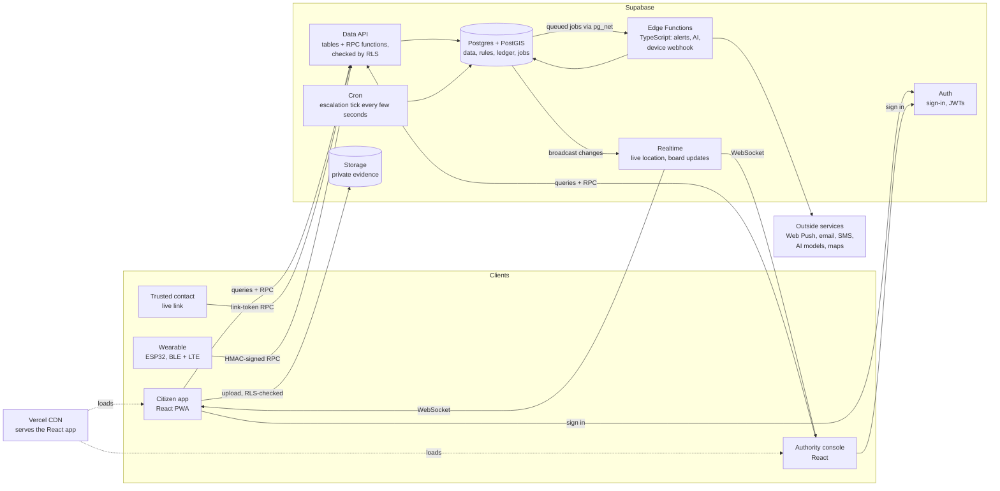
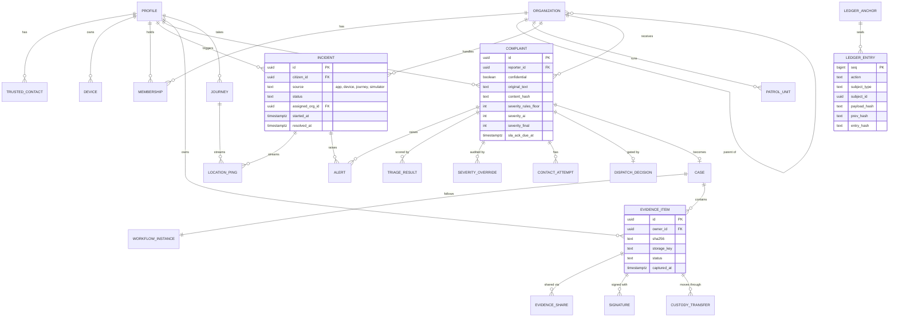
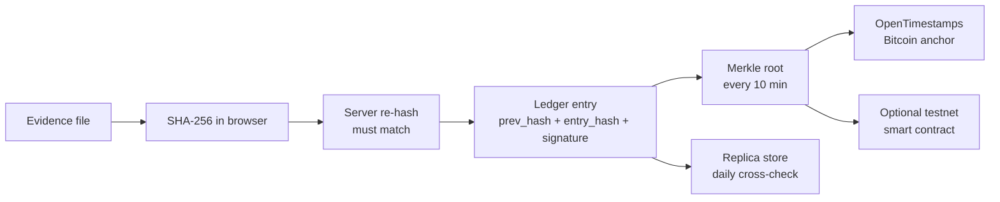
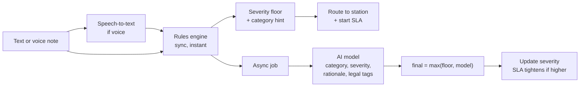
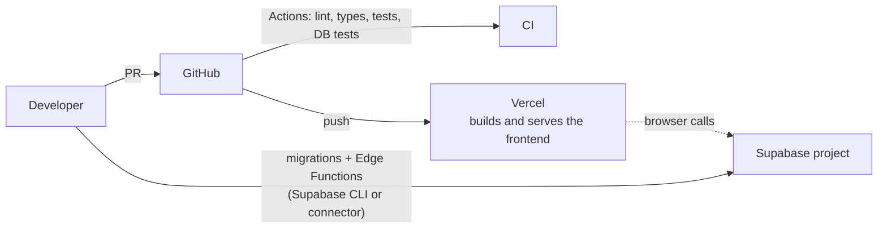

# 02 · System Architecture

> How the platform is built. The module IDs (M1–M14) come from [01-product.md](01-product.md).
> Step-by-step flows are in [03-workflows.md](03-workflows.md). Build order is in [04-roadmap.md](04-roadmap.md).

---

## 1. At a glance

**Style: Supabase-native.** Postgres *is* the core of the backend. Tables, row-level security (RLS) and SQL functions hold the business rules, so the browser talks to the database through Supabase's API with no app server in between. Code that needs secrets or outside services (sending alerts, AI, the wearable's webhook) runs in **Supabase Edge Functions** (TypeScript). **Supabase Realtime** pushes live updates, and **Supabase Cron** runs the timers. The React PWA is served from **Vercel**'s CDN.

**Why this shape:**

- **Fastest SOS path.** The browser makes one call (`rpc('create_sos')`) and Postgres writes the incident, the ledger entry and the follow-up job in a single transaction. There is no server to wake up and no extra network hop.
- **Rules live next to the data.** Every caller (app, console, Edge Function, even the SQL editor) goes through the same RLS policies and functions, so nothing can skip the ledger or a role check.
- **One backend platform.** It fits the free tier, and migrations and Edge Functions deploy through the connected Supabase project.



---

## 2. Hosting decision

**Decided in October 2026:** the backend runs entirely on **Supabase**, and the frontend is a static site on **Vercel**.

| | **Supabase only (chosen)** | Cloudflare Workers + Supabase DB | Python FastAPI on Render | Hugging Face Spaces |
|---|---|---|---|---|
| SOS write path | Browser → Postgres RPC | Browser → Worker → Postgres | Browser → FastAPI → Postgres | n/a |
| Idle wake-up | None for RPC calls; Edge Functions start quickly | None | About 1 min after 15 min idle (free tier) | New Docker Spaces need PRO ($9/month) since July 2026 |
| Live updates and timers | Built in (Realtime, Cron) | Durable Objects (a strong fit) | Build our own | n/a |
| Backend platforms | 1 | 2 | 2 | n/a |
| Language | SQL + TypeScript | TypeScript | Python | Python |

**Kept in reserve:** Cloudflare Workers with Durable Objects if realtime or timer load outgrows Supabase; Cloudflare Workers AI (Whisper) for speech-to-text, called from an Edge Function; Cloudflare R2 if evidence outgrows Supabase Storage; a Hugging Face ZeroGPU Space for custom models.

**Free-tier limits that matter (Supabase):**

| Limit | What we do |
|---|---|
| 500 MB database, 1 GB file storage, 50k monthly active users | Plenty for a demo. Upgrade before a pilot. |
| Edge Functions: 500,000 calls/month, 2 s CPU and 150 s per call | Keep heavy work (AI) in outside services; functions mostly wait on I/O. |
| Projects pause after 1 week without activity | Keep the project active, or upgrade for a pilot. |
| Built-in email only reaches the project's team members | Before real users sign up, add custom SMTP (for example Resend) or turn off email confirmation for the demo. |

**Region:** the project runs in Seoul (`ap-northeast-2`). Users in India would get lower latency from Mumbai (`ap-south-1`). The project is new, so moving means creating a Mumbai project and re-applying the migrations.

---

## 3. Tech stack

| Layer | Choice | Notes |
|---|---|---|
| **Frontend** | React 19 + TypeScript (strict) + Vite | SPA plus PWA (`vite-plugin-pwa`). React and Supabase ship as separate cached chunks. |
| UI | **shadcn/ui** + Tailwind CSS v4 + lucide icons | Shared components in `components/ui`. Severity color tokens. Dark mode. |
| Routing | **React Router** (data mode, `createBrowserRouter`) | Dynamic segments, nested layouts per role, lazy-loaded route modules (§13). |
| Server state | TanStack Query | Caching, retries, optimistic updates. Realtime events patch the cache. |
| Forms | react-hook-form + zod | The shadcn `Form` pattern. |
| API types | `supabase gen types typescript` | A typed supabase-js client generated from the schema. No hand-copied DTOs. |
| Maps | MapLibre GL (`react-map-gl`) + OpenFreeMap tiles + `h3-js` | Free vector tiles. Risk heatmap drawn as H3 hexagons. |
| **Backend** | Postgres functions (SQL, PL/pgSQL) + **Supabase Edge Functions** (TypeScript, Deno) | Business rules and the ledger in SQL. Edge Functions for secrets and outside APIs. |
| Schema & migrations | **SQL migrations in `supabase/migrations`** (Supabase CLI layout) | The single schema source. Internals live in a `private` schema the API does not expose. |
| Tooling | Supabase CLI, Deno, node:test database tests | |
| **Database** | Supabase Postgres + PostGIS | Spatial queries: nearest station, jurisdiction, route buffers. |
| Files | Supabase Storage (private buckets) | Storage policies let owners upload to their own folder only. |
| Auth | **Supabase Auth** for people. **HMAC keys** for wearables. **WebAuthn passkeys** for step-up. | Roles live in our own `profiles` table and are checked by RLS. |
| Jobs & timers | `jobs` table + **Supabase Cron** (ticks every few seconds) + `pg_net` to call Edge Functions | No separate worker process. |
| Realtime | **Supabase Realtime** (broadcast from the database, private channels checked by RLS) | |
| Notifications | Web Push (VAPID), email (an HTTP API such as Resend), SMS/WhatsApp (Twilio or Meta Cloud API), optional Telegram bot | Sent by the `notify` Edge Function (§8). |
| Geo data | OpenStreetMap, Overpass API (safe points), OpenRouteService (walking routes), Nominatim (geocoding), Uber H3 (risk grid) | |
| AI | Rules engine (always on) + Whisper speech-to-text + a triage model (Claude API or an HF ZeroGPU Space) | §9 |
| **Hosting** | Vercel (frontend), Supabase (database, API, functions, files, auth) | §2, §15 |
| CI/CD | GitHub Actions + Vercel Git integration | Lint, type-check and tests on every PR. Vercel deploys the frontend. |

---

## 4. Backend modules

Modules are domains, not servers. Each one owns its tables, its RLS policies and its SQL functions, plus an Edge Function when it needs secrets or outside services.

| Module | Responsibility | Main tables | Product IDs |
|---|---|---|---|
| `identity` | Profiles, roles, organizations, memberships, jurisdictions, passkeys | `profiles`, `organizations`, `memberships`, `passkeys` | all |
| `circle` | Trusted contacts and invitations | `trusted_contacts` | M1 |
| `devices` | Wearable registry, HMAC auth, heartbeat, tamper, simulator | `devices`, `device_events` | M13 |
| `sos` | Incidents, triggers, location stream, live links, resolve, cancel, duress | `incidents`, `location_pings`, `share_links` | M2, M3 |
| `dispatch` | Choosing responders, alerts, acknowledgements, escalation ladders, SLA timers | `alerts`, `escalation_policies`, `jobs` | M4 |
| `notify` | Channel adapters, templates, delivery receipts, push subscriptions | `notifications`, `push_subscriptions` | M4 |
| `complaints` | Intake, confidential mode, routing, lifecycle | `complaints`, `reporter_identities` | M6 |
| `triage` | Rules engine, AI provider adapters, severity rubric, legal tags | `triage_results`, `legal_tag_map` | M6, M7 |
| `authority` | Queue, Call & Connect, dispatch gate, patrol units, overrides, FIR drafts | `contact_attempts`, `dispatch_decisions`, `severity_overrides`, `patrol_units`, `fir_drafts` | M5, M7, M8 |
| `vault` | Evidence items, upload and verification, sharing, delayed deletion | `evidence_items`, `evidence_shares` | M9 |
| `custody` | Cases, procedural workflows, signatures, custody transfers, geofence checks | `cases`, `workflow_definitions`, `workflow_instances`, `signatures`, `custody_transfers` | M10 |
| `ledger` | Append-only hash chain, anchoring, verification | `ledger_entries`, `ledger_anchors` | all |
| `geo` | Safe points, zone reports, risk cells, safe routing | `safe_points`, `zone_reports`, `risk_cells` | M11 |
| `journeys` | Active monitoring, heartbeat, deviation and stop detection | `journeys` | M11 |
| `oversight` | Anomaly rules and models, review queue, weekly reports | `anomalies` | M14 |
| `fakecall` | Caller profiles and scripts | `fake_call_profiles` | M12 |

**Module rules**

1. A module owns its tables. Other modules call its functions and never write its tables directly.
2. Writes with rules go through **RPC functions** (`security definer`, checks inside) that write the record, the ledger entry and any job **in one transaction**. Plain reads go straight to tables, filtered by RLS.
3. Side effects (sending an alert, scheduling an escalation) are **rows in `jobs`**, picked up by the Cron tick or an Edge Function. Never fire-and-forget from the browser.
4. Internals (helpers, trigger functions, `ledger_append`) live in the `private` schema, which the API does not expose.
5. Time-based functions take the current time as a parameter (default `now()`), so tests can time-travel.

**Code layout**

```text
supabase/
  migrations/            # SQL: tables, RLS, RPC functions, triggers (one file per change)
  functions/             # Edge Functions (TypeScript, Deno)
    notify/              # sends queued alerts (email via Resend, Telegram)
    telegram-webhook/    # the Telegram bot: links contacts' chats, /stop unlinks
    triage/              # AI scoring for complaints (Phase 3)
    _shared/             # shared helpers: Supabase client, CORS
  tests/                 # database tests on plain Postgres (node:test)
  seed.sql               # demo stations
  config.toml
frontend/                # React PWA (§13)
```

---

## 5. Data model

Conventions:

- Time-ordered UUID primary keys, generated in the app.
- `timestamptz` in UTC everywhere.
- PostGIS `geography(Point, 4326)` for locations.
- `jsonb` for flexible payloads. Status values are text with check constraints.
- No hard deletes on case data: status changes plus ledger entries instead.

### 5.1 Core entities



### 5.2 Tables by module

| Module | Table | Key columns |
|---|---|---|
| identity | `profiles` | `id` (= auth user id), `full_name`, `phone`, `role`, `sos_pin_hash`, `duress_pin_hash`, `locale` |
| | `organizations` | `id`, `name`, `type` (police_station, campus_security, control_room), `parent_id`, `jurisdiction` (multipolygon), `location` |
| | `memberships` | `user_id`, `org_id`, `role` (officer, supervisor, dispatcher), `on_duty`, `badge_no` |
| | `passkeys` | `user_id`, `credential_id`, `public_key`, `sign_count` |
| circle | `trusted_contacts` | `owner_id`, `name`, `phone`, `email`, `contact_user_id?`, `priority`, `channels`, `status` |
| devices | `devices` | `owner_id`, `kind`, `hw_id`, `secret_enc`, `battery_pct`, `last_seen_at`, `status` (active, tamper, lost) |
| | `device_events` | `device_id`, `type` (heartbeat, gesture, tamper, battery_low, sos), `payload`, `at` |
| sos | `incidents` | see diagram, plus `last_location`, `resolution_code` |
| | `location_pings` | `subject_type` (incident, journey, unit), `subject_id`, `at`, `point`, `accuracy_m`, `speed`, `battery` |
| | `share_links` | `incident_id`, `token_hash`, `contact_id`, `expires_at`, `acked_at` |
| dispatch | `alerts` | `subject_type`, `subject_id`, `recipient_type`, `recipient_id`, `level`, `channel`, `status`, `sent_at`, `acked_at` |
| | `escalation_policies` | `org_id?`, `subject_type`, `levels` (jsonb: targets, channels, timeout per level) |
| complaints | `complaints` | see diagram, plus `transcript`, `language`, `location`, `occurred_at`, `routed_org_id`, `category_ai`, `category_final`, `status` |
| | `reporter_identities` | `complaint_id`, encrypted identity fields (confidential mode) |
| triage | `triage_results` | `complaint_id`, `provider`, `model`, `version`, `output` (jsonb), `created_at` |
| | `legal_tag_map` | `category`, `code_system` (e.g. BNS), `section`, `label`, `reviewed_by` |
| authority | `severity_overrides` | `complaint_id`, `officer_id`, `from_level`, `to_level`, `reason_code`, `justification`, `review_status` |
| | `contact_attempts` | `complaint_id`, `officer_id`, `channel`, `started_at`, `connected_at`, `ended_at`, `outcome` |
| | `dispatch_decisions` | `complaint_id`, `visit_required`, `reason_code`, `unit_id`, `decided_at` |
| | `patrol_units` | `org_id`, `call_sign`, `status`, `last_location`, `last_seen_at` |
| | `fir_drafts` | `complaint_id`, `version`, `content` (jsonb), `content_hash`, `pdf_item_id`, `status` |
| vault | `evidence_items` | see diagram, plus `kind`, `mime`, `size`, `capture_location`, `uploaded_at`, `locked_at`, `replica_key` |
| | `evidence_shares` | `item_id`, `org_id`, `subject_type`, `subject_id`, `granted_at`, `withdrawal_requested_at` |
| custody | `cases` | `complaint_id`, `org_id`, `scene_location`, `scene_radius_m`, `io_id`, `supervisor_id`, `status` |
| | `workflow_definitions` | `key`, `version`, `definition` (jsonb: states, transitions, requirements), `active` |
| | `workflow_instances` | `definition_id`, `subject_type`, `subject_id`, `current_state` |
| | `signatures` | `subject_type`, `subject_id`, `signer_id`, `purpose`, `payload_hash`, `method` (webauthn, ed25519), `signature` |
| | `custody_transfers` | `item_id`, `from_party`, `to_party`, `location`, `purpose`, `initiated_at`, `accepted_at`, `verified_hash`, `status` |
| ledger | `ledger_entries` | `seq`, `occurred_at`, `recorded_at`, `actor_id`, `actor_role`, `device_id`, `action`, `subject_type`, `subject_id`, `lat`, `lng`, `accuracy_m`, `payload`, `payload_hash`, `prev_hash`, `entry_hash` |
| | `ledger_anchors` | `from_seq`, `to_seq`, `merkle_root`, `method` (ots, evm, replica), `receipt`, `anchored_at` |
| geo | `safe_points` | `name`, `category`, `point`, `source` (osm, admin), `verified`, `open_hours` |
| | `zone_reports` | `reporter_id`, `point`, `h3_cell`, `type` (poor_lighting, isolated, harassment, no_transport), `at`, `status` |
| | `risk_cells` | `h3_cell`, `score_day`, `score_night`, `factors`, `sample_count`, `updated_at` |
| journeys | `journeys` | `user_id`, `origin`, `destination`, `route` (linestring), `eta`, `status`, `monitoring_level`, `last_ping_at` |
| oversight | `anomalies` | `type`, `severity`, `subject_type`, `subject_id`, `actor_id`, `details`, `status`, `reviewed_by` |
| fakecall | `fake_call_profiles` | `user_id`, `caller_name`, `voice`, `script` (jsonb) |
| platform | `jobs` | `kind`, `run_at`, `payload`, `status`, `attempts`, `locked_at`, `last_error` |

---

## 6. Integrity ledger (the "blockchain" layer)

This one service powers the incident timeline (I1#15, I2§4), evidence hashing (I1#10), the immutable audit log, chain of custody and the anti-suppression promise (I2§2, I2§3).

**What gets recorded:** every meaningful action. Examples: SOS triggered, alert sent, alert acknowledged, escalated, severity overridden, evidence registered, sealed, viewed, signed or transferred, workflow step completed, FIR draft version saved.
Individual GPS pings are **not** recorded one by one. Each minute of pings becomes a single entry holding the hash of that batch.

**Entry format:** `WHO → WHAT → WHEN → WHERE → HASH` (I2):

| Field | Meaning |
|---|---|
| `seq` | Position in the chain |
| `actor_id`, `actor_role`, `device_id` | Who did it, and from which device |
| `action`, `subject_type`, `subject_id` | What happened, and to what |
| `occurred_at`, `recorded_at` | When it happened, and when the server stored it |
| `lat`, `lng`, `accuracy_m` | Where (when known) |
| `payload_hash` | SHA-256 of the payload's `jsonb` text (for example the evidence file hash plus metadata) |
| `prev_hash` | `entry_hash` of the previous entry |
| `entry_hash` | SHA-256 over all fields above joined with `\|`, timestamps in UTC with microseconds (`ledger_entry_material()`) |

A platform signature over each `entry_hash` (Ed25519) is planned for Phase 4, alongside officer signatures.

**How tampering is prevented and detected:**

1. **Append-only, enforced by Postgres** (`supabase/migrations/*_ledger.sql`). A `BEFORE INSERT` trigger assigns `seq`, `recorded_at` and both hashes under an advisory lock, so callers cannot choose them. Triggers reject `UPDATE`, `DELETE` and `TRUNCATE`, even from the service role. Browsers cannot write at all: entries come from `ledger_append()`, which takes the actor from the session, called by domain functions or the backend. Corrections are new entries that reference the original (I2: "append a new corrective event").
2. **Hash chain.** Changing any past entry breaks every later `prev_hash` link. `ledger_verify()` recomputes every hash and reports the first broken entry; a nightly job runs it.
3. **Anchoring.** Every 10 minutes a Cron job computes a Merkle root over the new entries and publishes **only that root**, never personal data, to outside witnesses:
   - **OpenTimestamps**: free, and anchors into the Bitcoin blockchain.
   - Optional for the demo: a tiny smart contract on a public EVM testnet (for example Polygon Amoy).
4. **Replication (anti-suppression).** Evidence files and ledger heads are copied to a second, independently controlled store, standing in for the "institutional server". A daily job cross-checks hashes, and a mismatch opens an anomaly.
5. **Public verification.** On `/verify` anyone can drop a file. The browser hashes it locally (the file never leaves the device). The API returns when the file was registered, its ledger position, a Merkle proof and the anchor receipt.



**Honest framing** (I2 design note): the ledger proves *what was recorded, by whom, and when*, and that it has not changed since. It **does not decide legal compliance**. Admissibility of electronic evidence has to be confirmed with legal advisors.

---

## 7. Escalation & SLA engine (dead-man switch)

A single engine serves SOS escalation (I1#6, I2§3) and complaint SLAs (I3-A§1).

**Policy = data.** An ordered list of levels. Each level names its targets, channels and timeout. Policies are stored per organization in `escalation_policies`.

**Default SOS ladder** (configurable):

| Level | When | Who | Channels |
|---|---|---|---|
| L0 | Immediately | All trusted contacts, plus duty officers of the responsible station | Console, push, email/SMS live link |
| L1 | No acknowledgement after 2 min | Station supervisor, plus a contact reminder | Push, SMS/WhatsApp |
| L2 | No acknowledgement after 5 min | Parent organization (district control room). Flashing red. | Console, push, SMS |
| L2+ | Every 2 min afterwards | Repeat L2 and notify oversight | |

**Default complaint SLA** (time to acknowledge, by severity; configurable per organization):

| Severity | L5 Critical | L4 High | L3 Elevated | L2 Moderate | L1 Low |
|---|---|---|---|---|---|
| Acknowledge within | **3 min** | 10 min | 20 min | **30 min** | 4 h |

I3 fixes L5 at 3 min and L2 at 30 min. The other values are proposed defaults.

**Mechanics**

1. Creating an alert inserts an `escalation.check` row in `jobs` with `run_at = now() + timeout`, in the same transaction.
2. An acknowledgement marks the subject as acknowledged. The pending job becomes a no-op when it comes due.
3. **Supabase Cron** runs `private.escalation_tick()` every 5 seconds. It locks due jobs (`FOR UPDATE SKIP LOCKED`). For each one still unacknowledged it appends an `escalated` ledger entry, queues notifications for the next level and schedules the next check.
4. The `notify` Edge Function, called through `pg_net`, delivers the queued notifications and writes the results back to `alerts`.
5. The tick is idempotent and takes the current time as a parameter, so tests can time-travel.

**Golden-hour metrics** per incident: time to first acknowledgement, time to dispatch, time to arrival. They are shown on the console and in weekly oversight reports.

---

## 8. Realtime & notifications

**Realtime**

- **Supabase Realtime** over WebSockets, using private channels: `incident:{id}`, `journey:{id}`, `org:{id}:live`, `org:{id}:queue`, `user:{id}`. RLS policies on `realtime.messages` decide who may join each channel.
- Database triggers broadcast changes (incident status, acknowledgements, new queue items) to the right channel, so every write path produces the same live updates.
- **Messages are pings, not data** (`{"what": "location"}`). The client refetches through the normal RLS-checked reads, so a broadcast can never leak more than a read would, and a missed ping only costs a refresh. Screens poll slowly while the socket is up and every 5 s while it is down.
- The contact page (no account) listens on a **public** topic `live:<random>`. Only holders of a valid link learn its name (`view_share_link` returns it), and its pings carry nothing.
- Location goes up through an RPC (`record_location`, batched), so it still works when the socket drops. A trigger broadcasts it to the incident's channel.
- Trusted-contact live link `/t/:token`: 128-bit random token, stored hashed, read-only plus "I'm responding", expires 24 h after the incident closes.

**Notification channels** share one adapter interface, `send(recipient, message) → receipt`.

| Order | Channel | Cost | Notes |
|---|---|---|---|
| 1 | In-app (Realtime) | Free | Instant while the app is open |
| 2 | Web Push (VAPID) | Free | iOS requires the PWA to be installed |
| 3 | Email (Resend or Brevo API) | Free tier | Carries the live link |
| 4 | Telegram bot | Free | Good fallback for demos |
| 5 | SMS / WhatsApp (Twilio, Meta Cloud API) | Paid, or sandbox for testing | In India, commercial SMS needs DLT template registration and WhatsApp needs Meta business approval. Use sandboxes for the demo. |

A delivery that fails or stays unacknowledged moves to the next channel. Every attempt is stored in `alerts`.

**As built in Phase 1:** email (Resend) and Telegram. Each contact gets a personal live link, so the citizen sees who opened it. The `notify` function takes no input and runs without JWT verification: it only claims alerts the database already queued (`claim_alerts`, `FOR UPDATE SKIP LOCKED`) and reports each result (`finish_alert`, which writes the ledger), so calling it can do nothing but flush the queue. Telegram contacts link once through a one-time invite (`t.me/<bot>?start=<code>`); the chat id lives in `private.contact_telegram`. A channel without its key reports "skipped", never silence. Web Push arrives with the PWA service worker; SMS from the server waits on a provider (DLT in India).

---

## 9. AI components

### 9.1 Complaint triage (M6, M7)



- **Rules engine** (always on, in SQL or the `triage` Edge Function): an English, Hindi and Hinglish phrase lexicon plus patterns such as a weapon mentioned, an ongoing situation ("following me right now"), injury words or night time. It produces a **severity floor** and a category hint in under 50 ms. It is deterministic, explainable and works when the AI is down.
- **AI model** (pluggable and asynchronous; it never blocks the citizen). Two adapters:

  | Adapter | What | Cost | Trade-off |
  |---|---|---|---|
  | **A. Claude API** | `claude-opus-5-5` at **low effort** (a classification route). Schema-constrained JSON through structured outputs (Python SDK: `client.messages.parse(..., output_format=TriageResult)` with a Pydantic model). | Paid per call | Best with Hinglish and mixed-language text. Returns a readable rationale. Handle the `refusal` stop reason by keeping the rules result. |
  | **B. HF ZeroGPU Space** | Gradio Space running Whisper plus a multilingual zero-shot classifier, called with `gradio_client` | Free (5 GPU-min/day) | Can queue or cold-start. Weaker on romanized Hindi. |

- **Combining rule:** `final_ai_severity = max(rules_floor, model_severity)`. The model can raise severity but never lower it below the rules floor.
- **Output contract** (versioned):

  ```json
  {
    "category": "stalking",
    "severity": 4,
    "confidence": 0.86,
    "signals": ["being_followed", "night", "isolated_location"],
    "rationale": "Reporter says a man has followed her from the metro for 10 minutes and she is alone.",
    "legal_tags": ["BNS:stalking"],
    "provider": "claude",
    "model": "claude-opus-5-5",
    "rules_floor": 4,
    "version": "triage-v1"
  }
  ```

- **Severity rubric** (configurable):

  | Level | Meaning | Examples |
  |---|---|---|
  | **L5 Critical** | Immediate danger to life or body | Weapon, ongoing assault, abduction, "help me now", linked to an active SOS |
  | **L4 High** | Threat in progress | Being followed right now, harassment with threats, ongoing domestic violence |
  | **L3 Elevated** | Incident just happened or risk nearby | Groping just occurred, suspicious group nearby, doxxing |
  | **L2 Moderate** | Past incident | Yesterday's verbal harassment, persistent unwanted messages |
  | **L1 Low** | General concern | Poor street lighting, nuisance |

- **Legal tags:** a `legal_tag_map` table maps categories to candidate penal-code sections (for example under the Bharatiya Nyaya Sanhita). A legal reviewer maintains it, and officers see the tags only as **suggestions**.

### 9.2 Speech-to-text

- **In the browser:** live dictation through the Web Speech API (Chrome/Android, `en-IN` / `hi-IN`). Text appears instantly at no cost.
- **On the server:** Whisper produces the authoritative transcript of the stored voice note, through Cloudflare Workers AI (free daily allowance) or the HF Space, called from an Edge Function.
- The **original audio is always kept as sealed evidence**, so the citizen's exact words are preserved (I3-A§4).

### 9.3 Anomaly detection (M14)

- **Rules first:** expected-sequence checks (Capture → Hash → Sign → Seal), a missing custody event, a late upload (`uploaded_at` much later than `captured_at`), a GPS mismatch against the scene geofence, access by someone outside the case team, repeated failed logins, an officer's override rate.
- **Then statistics:** z-scores and an Isolation Forest on access and override patterns.
- **Output:** records in `anomalies`, sent to a supervisor or oversight review queue. AI flags; people decide (I2§5).

---

## 10. Geo: unsafe zones, safe points, safe routes, journeys

- **Risk cells.** The map is divided into H3 hexagons (resolution 9, about 0.1 km² each). Inputs:
  - complaints and SOS events, weighted by severity and fading over time;
  - citizens' zone reports (poor lighting, isolated, harassment hotspot);
  - OpenStreetMap streets tagged `lit=no`;
  - positive signals that lower risk: safe points and open businesses nearby.

  Day and night scores are computed separately by an hourly job. Each cell stores its top factors, so the map can explain *why* an area is red.
- **Privacy.** Only aggregated cells are shown, and only when a cell has at least *k* signals (default 3). The map never shows individual incident pins.
- **Safe points.** Imported from OpenStreetMap through Overpass (police, hospitals, pharmacies, transit stations, fuel stations). Admin-verified "safe havens" are added on top (campus security desks, partner shops).
- **Safe route.** Ask OpenRouteService for up to 3 walking alternatives. Score each one by risk exposure: the sum of cell risk along the path, weighted by time of day. Show **Safest** and **Fastest** with the time difference and the safe points along the way. If every option crosses a high-risk cell, retry with `avoid_polygons` around the worst cells (free-key limits: polygons up to 200 km², routes up to 150 km).
- **Journey monitoring.** The phone pings every 15 s, or every 5 s in high-risk cells at night. The server checks four conditions:
  - deviation of more than 150 m from the route for 60 s;
  - stopped for more than 3 min, away from a safe point or the destination;
  - no ping for 45 s;
  - entering a high-risk cell at night, which switches on active monitoring.

  The response is graded: an "Are you OK?" check-in → contacts alerted with the live link → an automatic SOS ([03-workflows.md](03-workflows.md#11-journey-monitoring)).

---

## 11. Evidence vault & custody

**Upload path**

1. The browser computes SHA-256: Web Crypto for small files, the streaming `hash-wasm` library for large videos.
2. `rpc('register_evidence')` records the hash, size, type, capture time and GPS, and returns the storage path.
3. The browser uploads straight to the private bucket. Storage policies allow writes only to the owner's own folder.
4. The `verify-evidence` Edge Function re-hashes the stored file. A match marks the item **Sealed** and adds a ledger entry. A mismatch rejects it and opens an anomaly.

**Protection**

| Concern | Design |
|---|---|
| Confidentiality | TLS in transit. The storage provider encrypts at rest. In Phase 4 we add app-level **AES-256-GCM envelope encryption** (a per-file key wrapped by a server master key). Later option: end-to-end mode with user-held keys, shared with officers by public-key wrapping. |
| "Biometric" unlock | A **WebAuthn passkey** (Face ID or fingerprint) unlocks the vault. This is the web equivalent of I3-C§2. |
| Attacker deletes evidence | Before sharing, the owner can delete, but only with a passkey, a 30-day recovery window and an email notice. After sharing, items cannot be deleted; a withdrawal request is logged instead. |
| Phone snatched mid-recording | Stealth and emergency recordings upload in 10-second chunks. Each chunk is hashed and sealed as soon as it arrives. |
| Retention | Emergency audio follows configurable retention limits (I1#9, I2§1), except when it is attached to a case (legal hold). |

**Custody (authority side)**

- A **case** follows a configurable procedural workflow (I2§2). Each **evidence item** moves through Registered → Sealed → Locked (2 signatures) → custody transfers → Submitted ([03-workflows.md](03-workflows.md#9-case-procedural-workflow)).
- **Signatures.** In the Phase 4 MVP each officer has a server-held Ed25519 key that is used only after passkey step-up. Upgrade path: WebAuthn assertions whose challenge is the payload hash, bound to the officer's device and non-repudiable.
- **Transfers** are two-party handshakes. The sender initiates and signs. The receiver accepts and signs. The system re-hashes the file at acceptance.

---

## 12. Security & privacy

- **Roles:** citizen, contact (link scope), officer, supervisor, oversight, admin, device.
- **Row-level rules:** officers see only items routed to their organization; supervisors see their organization and its children; citizens see only their own data. Enforced by Postgres row-level security and checks inside RPC functions, and covered by database tests.
- **Confidential mode:** identity is stored separately and encrypted. Officers see a pseudonym ("Citizen #A7F3"). Contact happens through in-app channels, so no phone number is exposed. Revealing the identity needs the citizen's consent, and every reveal is ledgered.
- **Data minimization:** location is collected only during an SOS or journey. Raw pings are deleted after 30 days unless attached to a case. Emergency audio follows retention limits.
- **Every evidence view or download is a ledger entry.** These entries feed anomaly detection.
- **Secrets** (provider API keys, VAPID keys) live in Supabase Edge Function secrets, never in git. The browser only ever holds the publishable key.
- **Abuse controls:** rate limits everywhere except the owner's own SOS creation (which is idempotent instead), false-alarm codes, verified sign-up.
- **Compliance considerations (India):** the Digital Personal Data Protection Act, 2023 (consent, purpose limitation, erasure requests against legal hold) and electronic-evidence certificate requirements under the Bharatiya Sakshya Adhiniyam, 2023. Both need to be validated with legal advisors before any pilot.

---

## 13. Frontend architecture

### 13.1 Route map (dynamic routing)

Each area is a lazy-loaded route tree with its own layout and role guard. Citizens never download console code.

| Area | Path | Screen |
|---|---|---|
| **Public** | `/` | Landing |
| | `/login`, `/signup`, `/auth/callback` | Auth |
| | `/t/:token` | Trusted-contact live view (no login) |
| | `/verify`, `/verify/:sha256` | Public evidence verifier |
| **Citizen** `/app` | `/app` | Home: SOS, quick actions, status |
| | `/app/sos/:incidentId` | Active SOS: who responded, live map, safe points, evidence capture, "I'm safe" |
| | `/app/incidents/:incidentId` | Past incident timeline |
| | `/app/map` | Safety map and route planner |
| | `/app/journeys/:journeyId` | Active journey |
| | `/app/report` | New complaint (one screen) |
| | `/app/reports`, `/app/reports/:complaintId` | My reports, status, in-app call |
| | `/app/vault`, `/app/vault/:itemId` | Evidence list and item (hash, verify, share, custody) |
| | `/app/circle`, `/app/circle/:contactId` | Trusted contacts |
| | `/app/fake-call`, `/app/fake-call/live` | Fake-call setup and full-screen call |
| | `/app/devices`, `/app/devices/:deviceId`, `/app/devices/simulator` | Wearables and the virtual keychain |
| | `/app/settings` | PINs, passkeys, privacy, notifications |
| **Console** `/console` | `/console` | Live board: active SOS and queue summary |
| | `/console/incidents/:incidentId` | Incident command view |
| | `/console/complaints`, `/console/complaints/:complaintId` | Triage queue (countdown matrix) and complaint workbench |
| | `/console/cases/:caseId` | Case workflow stepper and evidence checklist |
| | `/console/cases/:caseId/evidence/:evidenceId` | Evidence detail: hash, signatures, custody chain |
| | `/console/cases/:caseId/fir/:version` | FIR draft editor |
| | `/console/map` | GIS: incidents, units, risk layer |
| | `/console/reviews`, `/console/anomalies/:anomalyId` | Override reviews and anomalies |
| | `/console/admin/:section` | Stations, members, policies, workflows, legal tags |

After sign-in, users are redirected by role: citizens to `/app`, staff to `/console`.

### 13.2 Layouts & guards

- `PublicLayout`: marketing header and footer.
- `CitizenLayout`: mobile shell, bottom navigation, persistent SOS control, offline banner.
- `ConsoleLayout`: sidebar, top bar with on-duty toggle and escalation badge.
- `ContactLayout`: minimal, no navigation.
- Guards: `RequireAuth` and `RequireRole(roles)`, written as route loaders or wrapper elements.

### 13.3 Code layout

```text
frontend/src/
  app/            # router.tsx, providers, layouts, guards
  routes/         # route modules, one folder per area: public/, citizen/, contact/, console/
  features/       # domain logic and components: sos/, circle/, complaints/, vault/, ledger/,
                  #   geo/, journeys/, fakecall/, devices/, console/, oversight/
  components/ui/  # shadcn generated components
  components/     # shared composites: SeverityBadge, SlaTimer, MapView, Timeline, HashChip
  lib/            # api client (generated types), ws client, auth, crypto/hash, geo utils
  hooks/
```

### 13.4 Client patterns

- **Server state:** TanStack Query. Realtime messages update the cache directly.
- **Client state:** a small Zustand store for the session, connection status and the active SOS.
- **PWA:** installable, offline app shell, Web Push, and an **offline SOS queue** (IndexedDB + Background Sync) with the `sms:` fallback. *(Phase 1 built the IndexedDB queue, the retries while the app is open and the SMS fallback; Background Sync needs the service worker.)*
- **Browser APIs:** Geolocation, MediaRecorder, Web Crypto, WebAuthn, Screen Wake Lock, Vibration, Web Speech, Web Bluetooth (Android Chrome).

---

## 14. API conventions

- **Reads** go straight to tables through Supabase's Data API, filtered by RLS.
- **Writes with rules** are RPC functions: `supabase.rpc('create_sos', {...})`. Each one checks permissions, writes the record, the ledger entry and any job in one transaction.
- **Edge Functions** (`/functions/v1/<name>`) handle anything that needs secrets or outside services.
- **Types:** `supabase gen types typescript` generates the client types from the schema.
- **Auth:** supabase-js sends the user's JWT automatically.
  **Devices:** `POST /rest/v1/rpc/device_event` with only the publishable key. The body text carries a timestamp and nonce and is signed with HMAC-SHA256 using the device secret; Postgres verifies the signature itself, so no Edge Function sits in the path. Requests more than 5 minutes off or with a reused nonce are rejected. Full spec: [05 · Wearable protocol](05-device-protocol.md).
- **Idempotency:** RPCs that create records take a client-generated id (`p_client_id`, unique). A retry on a flaky network returns the existing record instead of a duplicate.
- **Errors:** SQL functions raise errors with stable codes and plain messages. For example, a skipped workflow state lists the missing requirements.
- **Times:** ISO-8601 in UTC; the UI shows local time.

Key calls by phase:

| Phase | Calls |
|---|---|
| P0 | `profiles` (own row), `organizations`, `rpc admin_set_role`, `rpc ledger_verify` |
| P1 | `trusted_contacts`, `rpc create_sos`, `rpc record_location`, `rpc resolve_incident`, `rpc set_sos_pins`, `rpc sos_pin_status`, `rpc incident_timeline`, `rpc view_share_link`, `rpc respond_to_share_link`, `rpc register_device`, `rpc reset_device_secret`, `rpc device_event`; `rpc nearby_safe_points`, `rpc disconnect_telegram`; service role only: `rpc claim_alerts`, `rpc finish_alert`, `rpc link_telegram`, `rpc unlink_telegram_chat`; Edge Functions `notify`, `telegram-webhook` |
| P2 | `rpc acknowledge_incident`, `rpc dispatch_unit`, `escalation_policies` (admin) |
| P3 | `rpc submit_complaint`, `rpc acknowledge_complaint`, `rpc set_complaint_severity`, `functions/v1/triage` |
| P4 | `rpc register_evidence`, Storage upload, `functions/v1/verify-evidence`, `rpc transition_case`, `rpc sign_evidence`, `rpc start_custody_transfer`, `rpc accept_custody_transfer`, `rpc lookup_hash` |
| P5 | `risk_cells`, `safe_points`, `rpc report_zone`, `functions/v1/safe-route`, `rpc start_journey`, `rpc journey_ping` |
| P6 | `rpc log_contact_attempt`, `rpc decide_dispatch`, `functions/v1/fir-draft` |

---

## 15. Deployment & operations



- **Environments:** local (`supabase start` with the Supabase CLI, `npm run dev`) and the hosted project. Add a staging project when a pilot starts.
- **Infrastructure as code:** SQL migrations and Edge Functions in `supabase/`. Frontend hosting settings in `frontend/vercel.json` (SPA routing, cache headers).
- **Observability:** Supabase logs (API, Postgres, Auth, Edge Functions) and advisors, Vercel deployment logs, optional Sentry free tier for frontend errors.
- **Key metrics:** time from SOS trigger to first alert sent, time to acknowledgement, SLA breaches, failed deliveries.
- **Testing:**
  - database tests on plain Postgres (RLS, role escalation, ledger, escalation tick with time travel);
  - frontend unit and routing tests;
  - Playwright end-to-end tests (SOS, complaint, evidence);
  - after each migration, the Supabase security and performance advisors.

---

## 16. Non-functional targets

| Metric | Target |
|---|---|
| SOS API response | p95 < 500 ms |
| First alert delivered (in-app or push) after an SOS | < 5 s |
| Live-location delay for viewers | < 3 s |
| Lost SOS events | 0 (idempotent writes, offline queue, durable jobs) |
| Ledger | Every entry verifiable. Full chain re-verified nightly. |
| Accessibility | WCAG 2.2 AA |
| Citizen app first load on 4G | < 3 s (code split by role) |
