# 03 · Workflows

> Step-by-step flows for every feature. Each one lists the **rules** the backend enforces.
> Architecture details are in [02-architecture.md](02-architecture.md).

| # | Workflow | Modules |
|---|---|---|
| 1 | [SOS: trigger to resolution](#1-sos-trigger-to-resolution) | M2, M3, M4 |
| 2 | [Incident states](#2-incident-states) | M2 |
| 3 | [Escalation ladder](#3-escalation-ladder) | M4, M5 |
| 4 | [Offline SOS](#4-offline-sos) | M4 |
| 5 | [Smart complaint: intake and triage](#5-smart-complaint-intake-and-triage) | M6 |
| 6 | [Complaint lifecycle](#6-complaint-lifecycle) | M5, M8 |
| 7 | [Accountability lock](#7-accountability-lock) | M7 |
| 8 | [Evidence vault: capture, seal, share](#8-evidence-vault-capture-seal-share) | M9 |
| 9 | [Case procedural workflow](#9-case-procedural-workflow) | M10 |
| 10 | [Custody transfer](#10-custody-transfer) | M10 |
| 11 | [Journey monitoring](#11-journey-monitoring) | M11 |
| 12 | [Fake call](#12-fake-call) | M12 |
| 13 | [Wearable gestures](#13-wearable-gestures) | M13 |

---

## 1. SOS: trigger to resolution

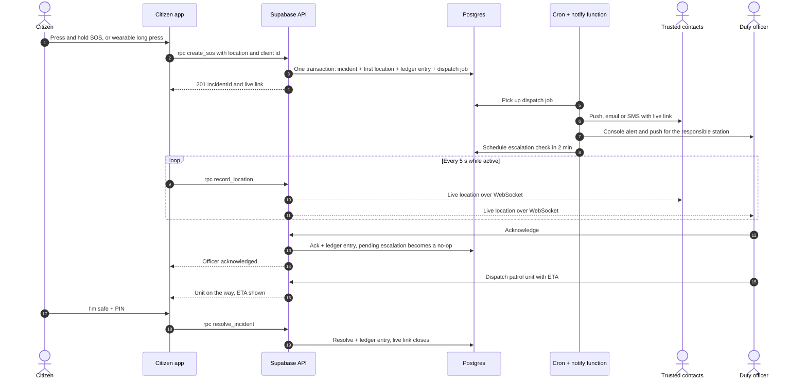

**Rules**

- `rpc create_sos` must answer in under 500 ms. Everything slow (notifications) happens in jobs.
- The same client id never creates a second incident.
- The responsible station is the one whose jurisdiction polygon contains the location. If there is none, the nearest station.
- "I'm safe" requires the SOS PIN. The **duress PIN** shows the same "cancelled" screen, but the incident stays active and escalates silently.
- The live link shows only this incident and expires 24 h after resolution.

---

## 2. Incident states

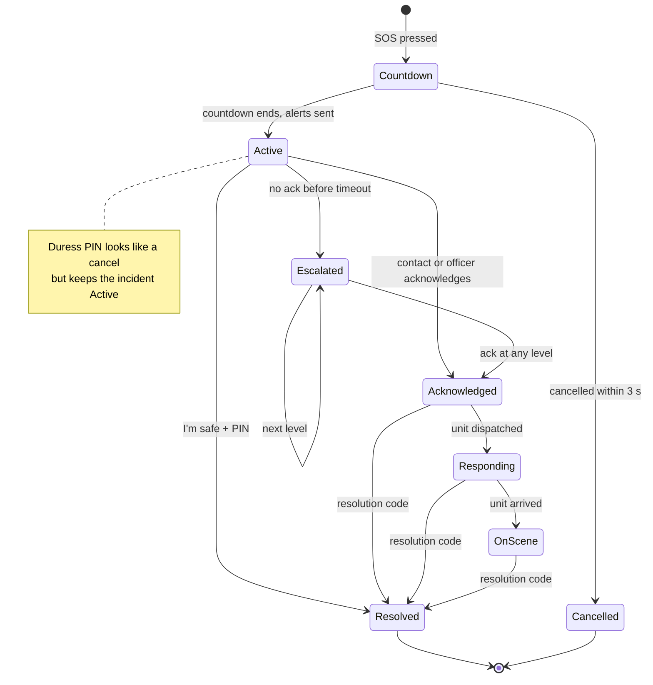

**Resolution codes:** `user_safe`, `assisted_on_scene`, `transferred_to_case`, `false_alarm`, `duplicate`.
Every transition is a ledger entry, and together they form the incident timeline.

---

## 3. Escalation ladder

The same engine runs SOS escalation and complaint SLAs ([02-architecture.md §7](02-architecture.md#7-escalation--sla-engine-dead-man-switch)).

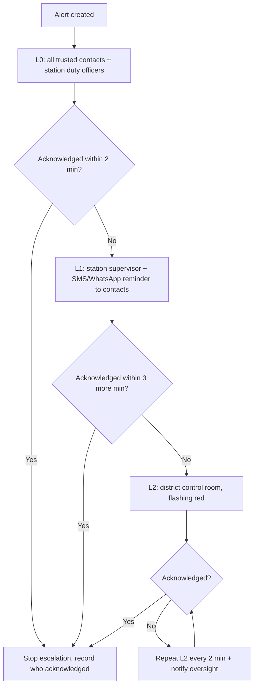

**Rules**

- Timeouts and targets come from `escalation_policies`, not code.
- Every escalation step appends a ledger entry. A missed SLA is permanently visible in reviews.
- Acknowledging is one click, and the first acknowledgement stops the ladder for everyone.
- **Built in Phase 1 (contacts only):** L0 alerts the circle in the SOS transaction; a `sos.reminder` job 2 minutes later re-alerts the circle and records `sos.no_response` unless someone is responding. Phase 2 adds officers, supervisors and the policy table.

---

## 4. Offline SOS

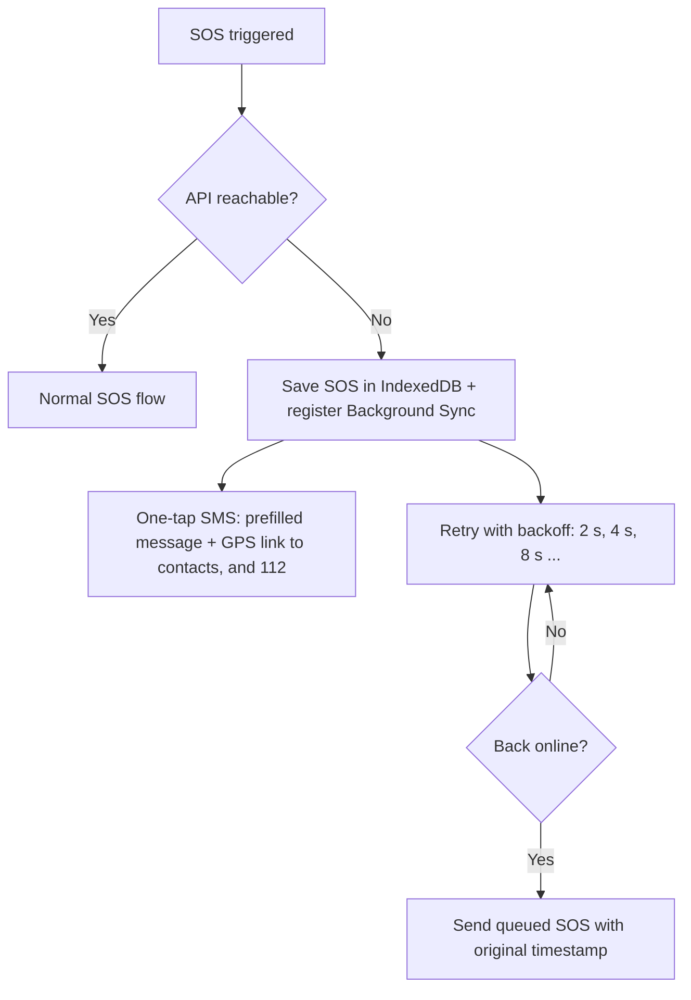

**Rules**

- GPS works without data, so the SMS always carries coordinates (`https://maps.google.com/?q=lat,lng`).
- A queued SOS keeps its **original** trigger time. The ledger records both when it happened and when the server received it.
- The wearable's modem handles its own SMS fallback ([§13](#13-wearable-gestures)).
- The queued SOS keeps its client id, so sending it twice can never create two incidents. The server refuses times in the future or more than a day old.
- Until the service worker exists, the queue is sent while the app is open (on start, on the browser's `online` event, and with backoff). The SMS fallback does not depend on it.

---

## 5. Smart complaint: intake and triage

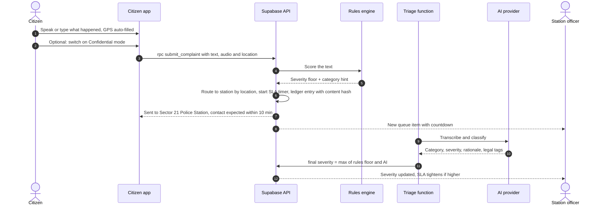

**Rules**

- The citizen sees the confirmation immediately, before the AI result arrives (I3-C§1 "Immediate action").
- The complaint text and audio are hashed at submission, so the citizen's exact words are anchored (I3-A§4).
- AI never lowers severity below the rules floor. AI never closes or rejects anything.
- **Confidential mode:** officers see a pseudonym and talk to the citizen through in-app channels only. Revealing her identity requires her consent in the app.

---

## 6. Complaint lifecycle

This covers Call & Connect, the dispatch gate and the FIR draft (I3-A§2, I3-A§4).

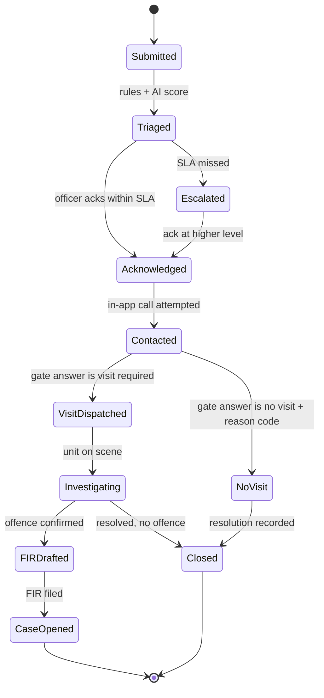

**Rules**

- **Call & Connect:** an officer cannot leave `Acknowledged` without at least one logged contact attempt (start time, connect time, outcome). Calls are browser-to-browser, so neither side sees the other's phone number.
- **Dispatch gate:** after the call, the console forces the question **"Physical visit required?"**
  - **Yes:** the GIS map opens and the nearest available patrol unit is suggested and assigned.
  - **No:** the officer must pick a standard reason code, for example `citizen_safe_at_home`, `report_only`, `referred_to_cyber_cell`.
- **FIR draft:** one click fills in the citizen's original words (with their hash), time, GPS and reverse-geocoded address, suggested legal tags, and evidence links with hashes and QR codes to `/verify`. Each saved version is hashed into the ledger. The officer files the official FIR in the government system.
- Closing always requires a resolution code. Nothing is ever deleted.

---

## 7. Accountability lock

From I3-A§3: police cannot quietly register a serious threat as a minor issue.

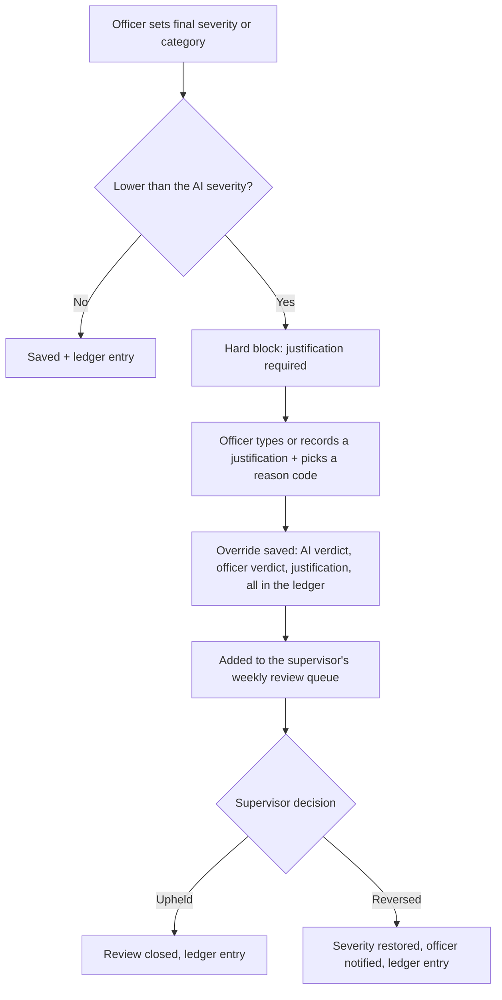

**Rules**

- The justification needs a minimum length, or a voice note. Picking a reason code alone is not enough.
- Each officer's override rate shows in oversight reports. An unusually high rate opens an anomaly (M14).
- Raising severity is never blocked.

---

## 8. Evidence vault: capture, seal, share

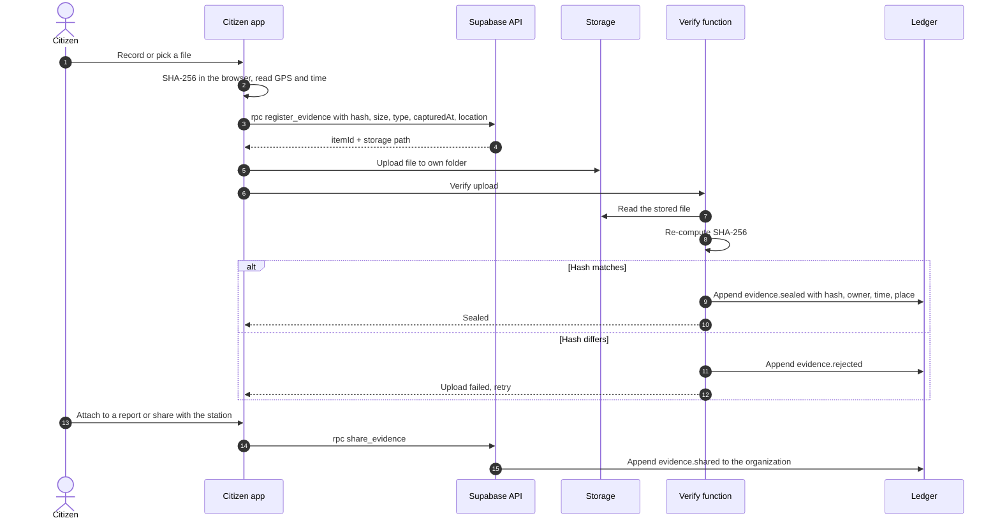

**Rules**

- Opening the vault needs a passkey (Face ID or fingerprint) once per session.
- Items shared with an authority can no longer be deleted. The citizen can only file a logged withdrawal request.
- Unshared items can be deleted with a passkey. They remain recoverable for 30 days and an email notice is sent, so a thief holding the phone cannot silently destroy evidence.
- Every view or download by anyone is a ledger entry.

---

## 9. Case procedural workflow

From I2§2, split into two clean levels: what happens to the **case**, and what happens to each **evidence item**.

### Case level (default "evidence handling" workflow, configurable)

```mermaid
stateDiagram-v2
  direction LR
  [*] --> Reported
  Reported --> Assigned: investigating officer assigned
  Assigned --> SearchInitiated: officer at scene, geofence check
  SearchInitiated --> VideographyDone: scene video sealed
  VideographyDone --> EvidenceIdentified: items listed
  EvidenceIdentified --> EvidenceSeized: every item sealed
  EvidenceSeized --> Signed: officer + supervisor signatures
  Signed --> InCustody: custody chain started
  InCustody --> Submitted: submitted to court
  Submitted --> [*]
```

### Evidence item level

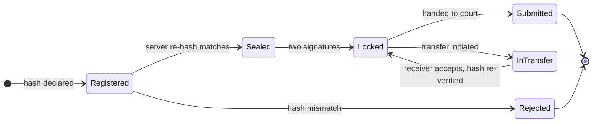

### Workflow definitions are data

```yaml
key: evidence-handling
version: 1
states: [reported, assigned, search_initiated, videography_done,
         evidence_identified, evidence_seized, signed, in_custody, submitted]
transitions:
  - from: assigned
    to: search_initiated
    roles: [officer]
    requires:
      geofence: { within_m: 200 }          # officer's location vs. scene
  - from: search_initiated
    to: videography_done
    requires:
      evidence: { kind: video, status: sealed, min: 1 }
  - from: evidence_seized
    to: signed
    requires:
      signatures: [investigating_officer, supervisor]   # multi-signature
```

**Rules**

- A transition is accepted only from the current state, by an allowed role, with every requirement met. Otherwise the API returns `409` and lists what is missing. **An officer cannot skip required states** (I2).
- A geofence failure is recorded as "location mismatch" and flagged for review. It is not silently ignored. Workflow config decides whether it blocks.
- Every transition is a ledger entry. Mistakes are fixed by compensating events, never edits.
- The legal applicability of each step stays configurable and subject to legal oversight (I2 design note).

---

## 10. Custody transfer

Example chain: Officer A → Evidence Locker → Forensic Lab → Officer B → Court (I2).

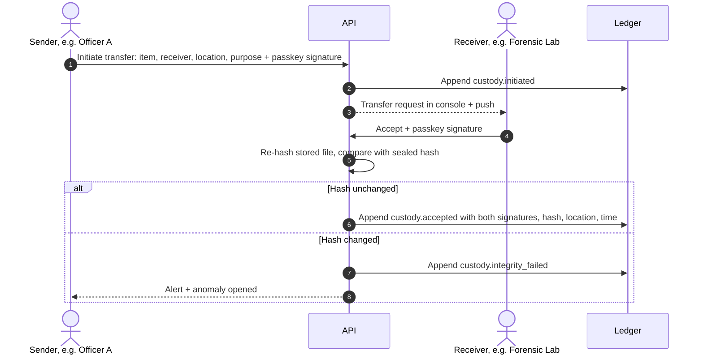

Each transfer records **sender, receiver, timestamp, location, evidence hash and both digital signatures** (I2).

---

## 11. Journey monitoring

From I3-C§4: dynamic mapping, background heartbeat and automated escalation.

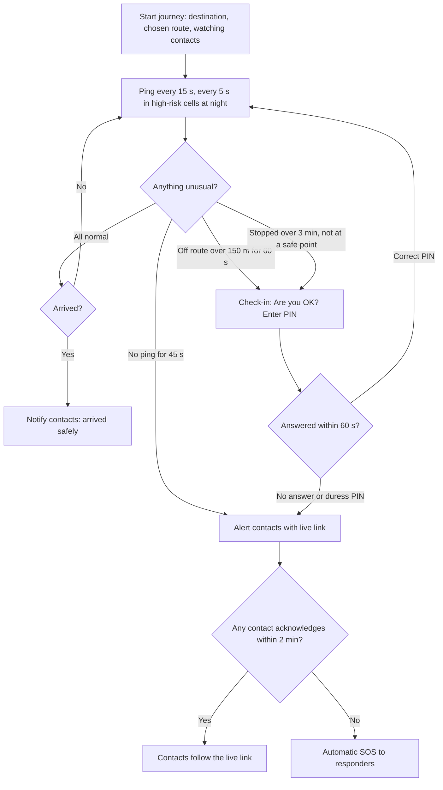

**Rules**

- A lost heartbeat skips the check-in, because the phone may be dead or snatched. Silence is the alarm.
- Entering a high-risk cell at night switches on active monitoring automatically (faster pings) and shows a discreet banner.
- Location is collected only while a journey is active.

---

## 12. Fake call

From I3-C§5, "Walk With Me".

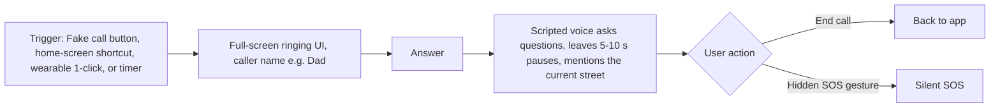

**Rules**

- It must ring within 1 s of the trigger. Audio and script are cached offline.
- Voice lines come from pre-recorded clips or in-browser text-to-speech. The street name comes from reverse geocoding the current location.
- The ringing screen copies a native call screen. It vibrates on Android (the Vibration API is not available on iOS).

---

## 13. Wearable gestures

From I3-C§3 and I2§1.

| Gesture | Action | Path | Needs the phone? |
|---|---|---|---|
| 1 click | Fake call on the phone | BLE → PWA (open, Android Chrome) | Yes |
| 2 clicks | Stealth audio recording | BLE → PWA | Yes |
| Long press (3 s) | SOS with GPS | LTE/Wi-Fi → API directly, SMS fallback | **No** |
| Heartbeat (every few minutes) | Battery, signal, armed status | LTE/Wi-Fi → API | No |
| Tamper (case opened, removed, heartbeat lost) | Tamper alert to citizen and contacts | Device event, or the server notices missing heartbeats | No |

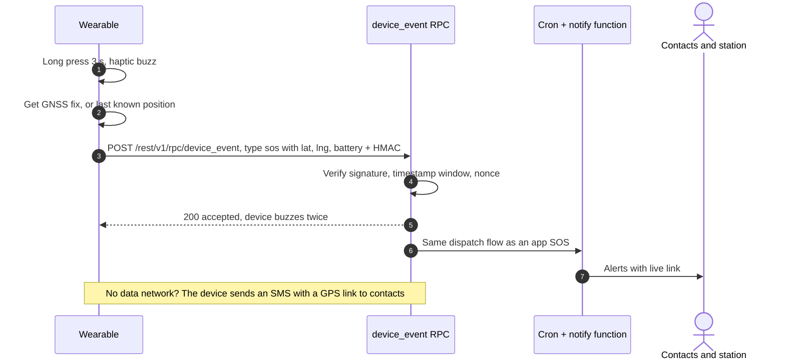

**Device protocol**

- Pairing assigns `device_id` plus a per-device secret.
- Each request carries the body text (with `ts` and `nonce` inside) and `HMAC-SHA256(secret, body)`.
- Requests more than 5 minutes off server time, or with a reused nonce, are rejected.
- Until the hardware exists, the **virtual wearable** (`/app/devices/simulator`) and `tools/device-simulator.mjs` send the same requests. Full spec: [05 · Wearable protocol](05-device-protocol.md).
- **Low-battery mode** stretches the heartbeat interval but always keeps the SOS path available.
