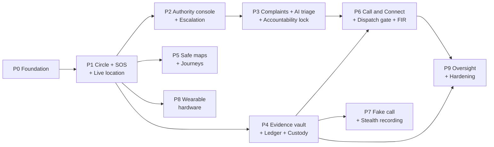

# 04 · Roadmap: Phases & Decisions

> We build **one feature slice at a time**. Each phase ends with something working on the deployed URLs that can be demoed.
> Module IDs (M1–M14) are defined in [01-product.md](01-product.md).

---

## 1. How we work

Every feature goes through the same five steps:

1. **Design check (about 30 min).** Re-read the relevant sections of these docs and note any change.
2. **Build the vertical slice.** Database migration → API → UI, all on one feature branch.
3. **Test.** Unit tests for rules, state machines and the ledger. API integration tests. One Playwright test for the main flow.
4. **Deploy.** Merging the PR into `main` auto-deploys.
5. **Demo and update docs.** Record a 1-minute demo and update these docs if the design changed.

The [Definition of Done](#5-definition-of-done-every-feature) at the end applies to every phase.

---

## 2. Phase map

| Phase | Theme | Modules | Size |
|---|---|---|---|
| **P0** | Foundation | platform | M |
| **P1** | Trusted Circle, Silent SOS, Live Location | M1, M2, M3, M4 (contacts) | L |
| **P2** | Authority Console & Smart Escalation | M4, M5 | L |
| **P3** | Smart Complaints, AI Triage, Accountability Lock | M6, M7 | L |
| **P4** | Evidence Vault, Integrity Ledger, Chain of Custody | M9, M10 | L |
| **P5** | Safe Maps & Journey Monitoring | M11 | L |
| **P6** | Call & Connect, Dispatch Gate, FIR Draft | M8 | M |
| **P7** | Fake Call & Stealth Recording | M12, M9 | M |
| **P8** | Wearable Hardware | M13 | L (hardware) |
| **P9** | Oversight, Anti-suppression, Hardening | M14, M10 | M |

### MVP cut line

**P0–P4 is the pitch-ready core.** Using the in-app wearable simulator, it covers 9 of the 10 "highlight" features listed in Ideas-2: silent trigger, multi-channel dispatch, live GPS, offline/SMS fallback, automatic escalation, evidence hashing, procedural state machine, chain of custody, immutable timeline. Tamper detection needs the real device (P8).

P5–P9 are enhancements. **P7's fake call has no dependencies**, so it can be pulled forward any time as a quick win.

---

## 3. Phase details

### P0 · Foundation

**Goal:** a deployed skeleton that every feature builds on.

**Status (October 2026):** built and live on the Supabase project, except the hosted sign-in check, which needs one Auth setting (below).

**Built**

- **Frontend shell** (`frontend/`): Vite + React 19 + TypeScript, Tailwind v4, shadcn/ui components, React Router 8 route trees for Public, Citizen (`/app`), Console (`/console`) and Contact (`/t/:token`) with lazy-loaded screens, role guards, dynamic segments and a 404 page. Supabase Auth sign-in and sign-up, redirect by role, light and dark themes with severity tokens. Later screens are placeholders that already receive their route params. SOS controls are visibly disabled and point to 112 until Phase 1. React and Supabase ship as separately cached chunks; app code is about 27 KB gzipped.
- **Database** (`supabase/`, applied to the hosted project): `profiles`, `organizations` and `memberships` with RLS, a sign-up trigger that creates citizen profiles, `admin_set_role()` (the only way to grant staff roles, ledgered), and the hash-chained ledger enforced by Postgres triggers with `ledger_verify()`. Internals live in a `private` schema the API does not expose. Demo stations seeded. Supabase security and performance advisors are clean apart from the two deliberate admin RPCs.
- **Tests and CI:** 16 frontend tests and 15 database tests, plus a live smoke test on the hosted project inside a rolled-back transaction. GitHub Actions runs lint, formatting, type-check, tests and build on every PR.

**Needs a dashboard setting (Supabase → Authentication)**

- Built-in email only reaches the project's team members. For the demo, turn off **Confirm email**, or add custom SMTP (for example Resend).
- Set **Site URL** to the deployed frontend URL and add it to **Redirect URLs**.

**Done when**

- [ ] A citizen and an officer can sign in on the deployed URLs and land on their own home screens. A citizen opening `/console` is blocked. *(Covered by tests; the hosted check waits on the Auth settings above.)*
- [x] Tests prove the ledger works: changing any stored entry makes `ledger_verify()` fail.
- [x] CI runs lint, type-check and tests on every PR.

---

### P1 · Trusted Circle, Silent SOS, Live Location

**Goal:** the core safety promise. Press SOS, and the right people see you live within seconds.

**Status (October 2026):** parts A and B are built and live on the Supabase project. Email and Telegram delivery switch on when their keys are added as Edge Function secrets (README → Alerts); until then each alert is recorded as "not sent: not set up yet", and the one-tap sharing still works.

**Built (part A)**

- **Database** (`20261002161421_circle_sos_devices.sql`): trusted contacts (up to 10, RLS per owner), incidents (one active per person, idempotent by client id), location pings (sealed into the ledger once a minute as a hashed batch), live links with 144-bit tokens that expire 24 h after the SOS ends, responders, SOS and duress PINs (bcrypt, five wrong tries lock for 10 minutes), and the wearable API: devices, per-device secrets, and `device_event()`, which verifies HMAC signatures, timestamps and nonces inside Postgres.
- **Citizen app:** hold-to-send SOS (1.5 s hold, 3 s cancel countdown, "Send now"), live SOS screen (streams location every 5 s, map, who's responding, send the link by WhatsApp, SMS to the circle, copy or share, call 112), "I'm safe" with PIN or duress PIN, the incident timeline from the ledger, trusted circle with alert order, Settings for name, phone and PINs, and Wearables.
- **Live link** `/t/:token` for contacts without an account: status, map, battery, call her or 112, "I'm responding", and a warning when she cancelled with the duress PIN.
- **Mock IoT:** the virtual wearable at `/app/devices/simulator` (hold 3 s for SOS, gestures, demo walk through Connaught Place, battery, heartbeat, tamper) and `tools/device-simulator.mjs`, both sending the exact requests the ESP32 will send. See [05 · Wearable protocol](05-device-protocol.md).
- **Tests:** 49 database tests and 39 frontend tests, a browser run of the virtual wearable, and a live smoke test on the hosted project inside a rolled-back transaction.

**Built (part B)**

- **Automatic alerts** (migrations `20261002202915` to `20261003134527`): the SOS transaction queues one `alerts` row per contact and channel (email, and Telegram once the contact has linked it) with a personal live link per contact, then asks `pg_net` to call the `notify` Edge Function, which claims due alerts, sends them through Resend or the Telegram Bot API and reports each result to the ledger. Failures retry after 30 s and 2 min; nothing waits silently longer than 15 minutes. Ending the SOS cancels unsent alerts and tells the contacts who got it that she is safe; the duress PIN changes nothing for them.
- **Durable timers:** a `private.jobs` table and `private.tick()`, run by Supabase Cron every 5 seconds. The first job: if nobody is responding 2 minutes after an SOS, the circle gets a reminder and the ledger records `sos.no_response` (the contact half of the P2 escalation ladder). The tick takes the time as a parameter, so the database tests travel in time.
- **Telegram:** each contact has a one-time invite (`t.me/<bot>?start=<code>`); the `telegram-webhook` function links the chat, `/stop` unlinks it, and the citizen can disconnect it.
- **Realtime instead of polling:** database triggers ping `incident:<id>` and `user:<id>` (private, checked by RLS on `realtime.messages`) and a secret `live:<topic>` for the contact page. Pings carry no data; screens refetch through the normal reads and fall back to polling while the socket is down.
- **Offline SOS:** without a connection the SOS is saved in IndexedDB with its client id and trigger time, a one-tap SMS with the GPS link opens for the circle, and the app sends it (2 s, 4 s, 8 s … 60 s, and at once when back online). The server keeps the original time and records the delay. Background Sync waits for the service worker (PWA work).
- **Nearby safe points:** police stations and hospitals from OpenStreetMap (central New Delhi), the nearest two of each on the SOS screen, the map and the contact page.
- **Tests:** 70 database tests, 52 frontend tests and 13 Edge Function tests; a live smoke test of the whole alert flow inside a rolled-back transaction.

**Scope**

- **Circle (M1):** add, edit and reorder contacts. Choose channels per contact. Invite contacts who already have accounts.
- **SOS (M2):** hold-to-trigger with a 3 s cancel countdown. SOS PIN and duress PIN. "I'm safe".
- **Live location (M3):** location streaming every 5 s. Live link page `/t/:token` with a map, status and an "I'm responding" button.
- **Alerts to contacts (M4, partial):** dispatch job, then Web Push and email (plus Telegram for demos). Delivery receipts.
- **Incident timeline:** read from the ledger.
- **Offline fallback:** IndexedDB queue, Background Sync, one-tap `sms:` link.
- **Nearby safe points (basic):** OSM import for the demo city. The nearest police station and hospital appear on the SOS screen.
- **Wearable simulator:** virtual keychain at `/app/devices/simulator`. Its long press calls the real device API with HMAC.

**Screens:** `/app`, `/app/circle`, `/app/circle/:contactId`, `/app/sos/:incidentId`, `/app/incidents/:incidentId`, `/app/devices`, `/app/devices/simulator`, `/app/settings`, `/t/:token`

**Done when** *(checked items are covered by tests and the live smoke test; they still need a run on the deployed URL)*

- [ ] Holding SOS sends contacts a push or email with the live link within 5 s. The map moves as the citizen walks. *(Built and smoke-tested up to the provider call: the alert is queued and `notify` is called in the SOS transaction. Delivery needs the email or Telegram key.)*
- [x] A contact taps "I'm responding" and the citizen sees it within 5 s.
- [x] "I'm safe" needs the PIN. The duress PIN shows "cancelled" while the alert stays active.
- [x] In airplane mode the SOS is queued, the SMS fallback opens prefilled, and the SOS is delivered once back online.
- [x] The simulator's long press creates an SOS exactly like the app button.
- [x] Every step appears on the incident timeline.

---

### P2 · Authority Console & Smart Escalation

**Goal:** authorities see SOS events live and act on them. Unanswered alerts climb the ladder automatically.

**Status (October 2026):** built and live on the Supabase project, with demo stations, patrol units and staff accounts (README → Demo console). Escalation shows on the console (flashing red, raised to the control room); push, email or SMS to supervisors waits for Web Push (PWA work) and the provider keys.

**Built**

- **Stations and routing** (`20261003144238`, `20261003144320`): PostGIS in the `extensions` schema; each organisation has a location and a jurisdiction polygon. The demo district is the New Delhi District Control Room over four police stations (Connaught Place, Tilak Marg, Chanakyapuri, Mandir Marg) and a campus security desk, with six patrol units. An SOS starts with the control room and is routed on its first location fix: the station whose jurisdiction covers the point, else the nearest within 50 km (ledger `incident.routed`).
- **Who sees what:** `private.can_see_incident()`: admins and oversight see everything, members of the handling station see its incidents, members of the organisation above see them once raised to them (and their supervisors always). Realtime pings go to `org:<id>` for the station and every organisation above it, checked by RLS.
- **Escalation engine:** policies are data (`escalation_policies`, a default plus per-station overrides, edited at `/console/admin/escalation`). The default ladder: 2 min unacknowledged → the station is re-alerted and the row flashes red; 5 min → raised to the district control room; then every 2 min, each repeat also flagging oversight. Each level is an `incident.escalate` job run by `private.tick()`; any acknowledgement stops it. Every step is an `incident.escalated` ledger entry and an `incident_escalations` row.
- **Console** (`20261003144444`): `/console` live board (most urgent first, flashing red when escalated and unacknowledged, map, live via Realtime), `/console/incidents/:id` (acknowledge, dispatch a unit with an ETA, mark on scene, close with a code and note, live map, golden-hour metrics: time to acknowledge, dispatch and arrival, sealed timeline), `/console/map`, the on-duty toggle in the header, and escalation policies for admins.
- **What the citizen and contacts see:** the SOS screen and the live link show the station, "Officer on the way: CP-PCR-1 from Connaught Place Police Station, arriving in about 6 minutes", arrival, and a call button for the station's duty desk.
- **Mock incidents** (`20261003144500`): "Load demo incidents" (admins and supervisors) closes earlier demo incidents and starts three fresh ones from mock citizens at 40 s, 3.5 min and 6 min old, so the board shows every escalation state at once.
- **Tests:** 84 database tests (14 new: routing, visibility, Realtime topics, the ladder on a fake clock, acknowledgement stopping it, the full response flow, unit and policy permissions, demo data), 69 frontend tests, and a live smoke test on the hosted project inside a rolled-back transaction.

**Scope**

- Routing by jurisdiction (PostGIS) and a duty roster (on-duty toggle).
- **Live board:** active incidents on a map and a list, with live location, battery, GPS status, time since trigger and acknowledgement state.
- **Incident command view:** acknowledge, assign a patrol unit, ETA, mark arrival, resolve with a code.
- **Escalation engine:** the L0 → L1 → L2 policy from [02 §7](02-architecture.md#7-escalation--sla-engine-dead-man-switch), editable in `/console/admin/escalation`, with flashing red for escalated items and push to supervisors.
- Golden-hour metrics per incident.

**Screens:** `/console`, `/console/incidents/:incidentId`, `/console/map`, `/console/admin/:section`

**Done when** *(checked items are covered by tests and the live smoke test; they still need a run on the deployed URL)*

- [x] An SOS appears on the correct station's board within 5 s. *(Routed in the location transaction; the station's `org:` topic is pinged at once.)*
- [x] With no acknowledgement for 2 min the station is re-alerted and the incident flashes red for its officers and supervisors. After 5 min the district control room is alerted. Any acknowledgement stops the ladder. *(Push to supervisors' phones comes with Web Push.)*
- [x] The citizen sees "Officer on the way: CP-PCR-1 …, arriving in about 6 minutes".
- [x] Escalation timing is covered by fake-clock tests.

---

### P3 · Smart Complaints, AI Triage, Accountability Lock

**Goal:** frictionless reporting that is scored, routed and cannot be quietly downgraded.

**Status (October 2026):** built and live on the Supabase project. The rules triage runs on every report; the Gemini adapter is deployed as the `triage` Edge Function and switches on when `GEMINI_API_KEY` is added as a function secret (README → AI triage). Until then each report records "AI review skipped" and the rules' answer stands.

**Built**

- **Rules engine** (`20261003183841`): a lexicon of English, Hindi (Devanagari) and Hinglish patterns in `private.triage_lexicon` plus per-category severities for past / just now / happening now. `private.triage_rules()` returns category, severity floor, signals, language and a rationale in a few milliseconds. *"ek aadmi metro se mera peecha kar raha hai"* → stalking, L4, "happening now, on public transport". The report screen shows this answer live as the citizen types (`triage_preview`).
- **Filing** (`create_complaint`): idempotent by client id, routed with the P2 jurisdiction lookup (else the control room), SLA deadline from `complaint_sla` (L5 3 min, L4 10, L3 20, L2 30, L1 4 h), ledger `complaint.filed` with a SHA-256 of the text.
- **SLA ladder:** a `complaint.escalate` job at the deadline; missed → the station's queue flashes red (level 1), then raised to the organisation above (level 2), then repeats that flag oversight. Acknowledging stops it. A severity change moves the deadline.
- **AI triage** (`triage` Edge Function, `_shared/triage.ts`): claims waiting complaints (`claim_triage`, service role only), asks Gemini (`gemini-flash-latest`) for schema-checked JSON (controlled generation), handles safety blocks and retries, and reports with `finish_triage`, which enforces *final = max(rules floor, model)*, ignores unknown categories and tightens the SLA when severity rises. Checks at 45 s, +60 s, +60 s re-ask the function; after three silent tries it records "AI review failed".
- **Accountability lock** (`set_complaint_severity`): raising is free; going below the AI baseline needs a justification of at least 20 characters, writes `severity_overrides` and the ledger, and lands in `/console/reviews` for supervisors of that station or above (never the officer who made it), grouped by week. Reversing needs a note and restores the baseline.
- **Confidential mode:** officers see "Reporter 7F3K" and no name, phone or account id anywhere in the console RPCs; the citizen can share their identity later (`share_complaint_identity`, logged). *Note:* the link to the account stays in the database, protected by RLS and the RPCs, rather than encrypted with a separate key; key-based encryption is part of the P9 hardening.
- **Screens:** `/app/report` (text or live dictation in English or Hindi via the browser's speech recognition, location, "when", confidential toggle), `/app/reports` and `/app/reports/:id` (status, police note, timeline, share identity), `/console/complaints` (queue with live countdowns), `/console/complaints/:id` (workbench: report, rules and AI panels, acknowledge, in progress, change severity, resolve/close with a note for the citizen, sealed timeline), `/console/reviews`. The live board shows the three most urgent complaints. "Load demo complaints" (admins, supervisors) files four mock reports, one already past its SLA.
- **Tests:** 102 database tests (18 new), 20 Edge Function tests (7 new), 77 frontend tests, and a live smoke test inside a rolled-back transaction.

**Scope**

- **Report screen (M6):** one screen with text or voice (live dictation), auto GPS (adjustable pin), "when did it happen", and a Confidential toggle with a plain-language explanation.
- **Triage:** rules engine (sync), then an AI adapter (async). The provider is chosen in decision D5 below.
- **Routing and SLA:** route to a station by location. Countdown matrix in `/console/complaints` sorted by time left. SLA escalation reuses the P2 engine.
- **Accountability lock (M7):** downgrade block, justification form, ledger entry, weekly review queue for supervisors.
- **Confidential mode:** pseudonymous reporter, identity stored encrypted, reveal only with consent.

**Screens:** `/app/report`, `/app/reports`, `/app/reports/:complaintId`, `/console/complaints`, `/console/complaints/:complaintId`, `/console/reviews`

**Done when** *(checked items are covered by tests and the live smoke test; they still need a run on the deployed URL)*

- [ ] A Hinglish voice note such as *"ek aadmi metro se mera peecha kar raha hai"* becomes a transcript, category `stalking`, L4 and a rationale. The rules answer is instant and the AI update follows within about 30 s. *(Transcript and the instant rules answer are done; the AI update needs `GEMINI_API_KEY`. Voice uses the browser's live dictation, not a server-side speech model.)*
- [x] An L5 complaint shows a 3-minute countdown. A missed SLA escalates.
- [x] Downgrading below the AI severity is blocked until a justification is entered. The override then appears in the supervisor's review queue.
- [x] Confidential complaints never show the citizen's name or phone number to officers.

---

### P4 · Evidence Vault, Integrity Ledger, Chain of Custody

**Goal:** evidence that is provably unaltered, cannot be suppressed, and follows procedure.

**Status (October 2026):** built and live on the Supabase project, with the `evidence` and `anchor` Edge Functions deployed. The first ledger anchor has been stamped by OpenTimestamps. Passkey unlock and envelope encryption moved to P9 (below).

**Built**

- **Vault** (`20261003193622`, `20261003193743`): `evidence_items` and a private Storage bucket (`evidence`, 50 MB per file, path `<owner>/<item>`). The browser hashes the file (Web Crypto SHA-256), `register_evidence` records the hash, size, type, capture time and GPS, the browser uploads to its own path (Storage RLS: only to a registered item, once, never overwritten), and `confirm_evidence_upload` queues a server re-hash. The `evidence` Edge Function downloads the stored file and reports its SHA-256; `finish_evidence_check` seals only on a match (ledger `evidence.sealed`, written by the system with no person or place in it) and otherwise rejects it. Sharing to a report or SOS (`share_evidence`) puts the item on that case; deletion waits 30 days and is impossible once shared.
- **Cases and workflows** (`20261003193900`): workflows are data (`workflow_definitions`, versioned; open cases keep their version; edited at `/console/admin/workflows`). Requirements: evidence sealed, geofenced site visit (within 200 m), statement, evidence locked, custody complete. `advance_case` moves forward only when every requirement up to the target is met; otherwise nothing changes, the missing requirements come back and `case.advance_blocked` is ledgered.
- **Signatures, lock and custody:** each officer has a server-held key (HMAC-SHA256; WebAuthn is the upgrade path). Locking needs the investigating officer's and a supervisor's signature. A hand-off is signed by the sender, accepted and signed by the receiver, and the stored file is re-hashed before custody moves; a mismatch stops it.
- **Anchoring and the verifier** (`20261003194009`): every 10 minutes (Cron) a Merkle root over the new ledger entries; the `anchor` function submits only the 32-byte root to OpenTimestamps calendars and stores the receipt. `verify_evidence` (public) returns the sealing entry, its fields and the Merkle proof, so `/verify` re-checks the payload hash, entry hash and proof in the browser and offers the `.ots` file.
- **Screens:** `/app/vault`, `/app/vault/:itemId`, `/console/cases`, `/console/cases/:caseId`, `/console/cases/:caseId/evidence/:evidenceId` (checklist ✓ captured, ✓ hashed, ✓ sealed, ✓ signed, ✓ custody, ✓ anchored), `/console/admin/workflows`, `/verify`, `/verify/:sha256`, and "Case and evidence" on the complaint workbench.
- **Tests:** 115 database tests (13 new), 27 Edge Function tests, 87 frontend tests, and a live smoke test inside a rolled-back transaction.

**Moved to P9:** passkey (WebAuthn) unlock of the vault and before deletion, app-level AES-256-GCM envelope encryption (Storage encrypts at rest today), the e-mail notice on deletion, and Ed25519/WebAuthn signatures instead of server-held HMAC keys.

**Scope**

- **Vault (M9):** capture or upload, browser hashing, direct upload, server re-hash, "Sealed" badge, passkey unlock, envelope encryption, share to report or incident, delayed deletion.
- **Custody (M10):** cases, a workflow engine with definitions stored as data (admin screen), geofence checks, two-signature lock, custody hand-off handshake, evidence dashboard checklist (✓ captured, ✓ hashed, ✓ signed, ✓ custody, ⚠ missing step).
- **Ledger anchoring:** Merkle roots stamped with OpenTimestamps. Optional testnet contract.
- **Public verifier:** `/verify`.

**Screens:** `/app/vault`, `/app/vault/:itemId`, `/console/cases/:caseId`, `/console/cases/:caseId/evidence/:evidenceId`, `/console/admin/workflows`, `/verify`, `/verify/:sha256`

**Done when** *(covered by tests and the live smoke test; they still need a run on the deployed URL)*

- [x] An uploaded file shows "Sealed" with its hash. On `/verify`, the original matches and a copy with one changed byte does not.
- [x] Skipping a workflow state returns the list of missing requirements.
- [x] Locking needs both the investigating officer's and the supervisor's signature.
- [x] The custody chain shows each hand-off with both signatures and a re-verified hash.
- [x] Sealed items show an anchor receipt. *(The OpenTimestamps receipt is pending until the calendar commits it to Bitcoin, a few hours later; `ots upgrade` then completes it.)*

---

### P5 · Safe Maps & Journey Monitoring

**Status (October 2026):** built and live on the Supabase project, with a seeded red zone on Janpath for the demo.

**Built**

- **Risk cells** (`20261003195914`): a 0.003° grid (about 330 m × 290 m; Supabase has no H3 extension, so a plain grid stands in for H3 resolution 9). An hourly Cron job scores each cell for day and night from complaints (by severity), SOS events and citizens' zone reports, with a 30-day half-life; a signal counts fully in its own period and 30% in the other, poor lighting only at night, and safe points lower the score. Each cell keeps its factors so the map explains why it is red. `risk_map` returns only cells with at least k = 3 signals, never individual reports.
- **Zone reports** (`report_zone`): poor lighting, isolated, harassment, unsafe crowd, no transport; 20 a day per person.
- **Safe routes:** walking alternatives from the keyless OSRM foot router (FOSSGIS, OpenStreetMap), scored by `score_routes` (risk exposure along points every 50 m, high and medium cells crossed, safe points within 150 m). When every option crosses a high-risk cell, the app asks again through detour points on either side of the worst cell (the keyless router has no `avoid_polygons`; OpenRouteService can replace it with a key).
- **Journeys** (`20261003200016`): pings every 15 s, 5 s under active monitoring (a high-risk cell at night). A watchdog job: off the route by more than 150 m for 60 s, or stopped 3 minutes away from a safe point or the destination → "Are you OK?" with the PIN (60 s); no answer, the duress PIN, or 45 s without a ping → an SOS for the person, which alerts the circle with the live link and reaches the station's board. Arrival within 75 m ends the journey.
- **Screens:** `/app/map` (day/night layer, why areas are red, report a place, Safest vs Fastest with the time difference, start a watched journey), `/app/journeys/:journeyId` (route and path, check-in, demo walk that can stop), risk layer on `/console/map`.
- **Tests:** 123 database tests (8 new, on a fake clock), 96 frontend tests (9 new), and a live smoke test inside a rolled-back transaction.

**Scope (M11)**

- Zone reports. Hourly risk-cell job (H3, day and night).
- Heatmap and safe-point layers.
- Safest vs fastest routes (OpenRouteService alternatives plus risk scoring).
- Journeys with heartbeat checks and graded escalation. Automatic active monitoring in high-risk cells at night.

**Screens:** `/app/map`, `/app/journeys/:journeyId`, risk layer on `/console/map`

**Done when** *(covered by tests and the live smoke test; they still need a run on the deployed URL)*

- [x] The map shows day and night risk using aggregated cells only (at least *k* signals per cell).
- [x] "Safest" avoids a seeded red zone and shows the time trade-off.
- [x] A 3-minute stop triggers a check-in. With no answer, contacts are alerted. With no acknowledgement, an SOS is created. *(The unanswered check-in raises the SOS at once, so contacts get the live link and the station sees it together, a step stricter than contacts-first; the P1 reminder and the P2 ladder then run as for any SOS.)*

---

### P6 · Call & Connect, Dispatch Gate, FIR Draft

**Scope (M8)**

- Browser-to-browser audio calls: WebRTC with signaling over our WebSocket and a TURN server (decision D8).
- Contact-attempt records.
- Gate enforcement with reason codes, plus a nearest-available-unit suggestion.
- FIR draft generator with PDF export, each version ledgered.

**Screens:** call panel and gate in `/console/complaints/:complaintId`, `/console/cases/:caseId/fir/:version`, incoming-call screen in `/app/reports/:complaintId`

**Done when**

- [ ] An officer calls the citizen in the app. Neither sees the other's number, and the attempt times are logged.
- [ ] A complaint cannot move on without a gate decision. "No visit" requires a reason code.
- [ ] One click produces a FIR draft containing the citizen's original words with their hash, the location, and evidence links with QR codes.

---

### P7 · Fake Call & Stealth Recording

**Scope (M12, M9)**

- Caller profiles and scripts, a full-screen ringing UI, interactive audio with pauses, the current street name, and a hidden SOS gesture.
- Stealth recording in 10-second chunks, each sealed on arrival, with retention settings.

**Screens:** `/app/fake-call`, `/app/fake-call/live`, recording control on `/app/sos/:incidentId` and in the wearable simulator

**Done when**

- [ ] The fake call rings within 1 s and carries a 60-second scripted conversation.
- [ ] Killing the app mid-recording keeps every completed chunk sealed in the vault.

---

### P8 · Wearable Hardware

**Scope (M13)**

- **Hardware:** an ESP32 for BLE (and Wi-Fi), an LTE Cat-1 modem with GNSS (avoid 2G-only modules such as the SIM800L, because Jio, India's largest network, has no 2G), a button, a LiPo battery with charger, a vibration motor and a tamper switch. The final parts list is decided at the start of this phase.
- **Firmware:** gesture detection, HMAC client, heartbeat, tamper events, low-battery mode, SMS fallback.
- **App:** pairing through Web Bluetooth (Android Chrome) or a pairing code. Device health screen.

**Screens:** `/app/devices`, `/app/devices/:deviceId`

**Done when**

- [ ] A long press on the physical device creates an SOS with GPS without touching the phone.
- [ ] Missed heartbeats or opening the case raises a tamper alert.
- [ ] In low-battery mode, SOS still works.

---

### P9 · Oversight, Anti-suppression, Hardening

**Scope (M14, M10)**

- Anomaly rules and an Isolation Forest, a review queue and a weekly oversight report.
- Replica store with a daily cross-check job.
- Retention jobs and a security review.
- Carried over from P3/P4: key-based encryption of confidential reporter identity, passkey (WebAuthn) vault unlock and step-up signatures, AES-256-GCM envelope encryption of evidence, the e-mail notice on deletion.
- Load test of the SOS path, accessibility audit, Hindi translation.
- Optional Capacitor native wrapper for lock-screen and background features.

**Screens:** `/console/anomalies`, `/console/anomalies/:anomalyId`, `/console/reports/weekly`

**Done when**

- [ ] A seeded "Capture → Sign → Seal" sequence (hash step missing) raises a **Missing hash** anomaly for review.
- [ ] Deleting a replica file is detected within 24 h.
- [ ] The SOS path meets its latency targets under load.

---

## 4. Decisions

D1 to D4 are decided. The rest have recommended defaults; confirm or change them when the phase that needs them starts.

| # | Decision | Recommended default | Alternative |
|---|---|---|---|
| D1 | Backend runtime | **Decided: Supabase-native.** Rules and ledger in Postgres (RPC functions + RLS), Edge Functions (TypeScript) for secrets and outside APIs, Realtime, Cron. | Cloudflare Workers + Durable Objects (kept in reserve), Python FastAPI on Render (about 1 min wake-up on free tier) |
| D2 | Database & files | **Decided: Supabase** Postgres + PostGIS + Storage (project `women's safety`) | Cloudflare R2 for evidence if storage outgrows 1 GB |
| D3 | Auth | **Decided: Supabase Auth**, roles in `profiles`, checked by RLS | n/a |
| D4 | Frontend hosting | **Decided: Vercel** (global CDN, preview URL per PR) | Cloudflare Pages, Render Static Site |
| D5 | Triage AI | **Decided: rules engine first** (built in P3). The Gemini API adapter (`gemini-flash-latest`, schema-constrained JSON) is deployed and switches on with `GEMINI_API_KEY`. | HF ZeroGPU Space (free, quota-limited) |
| D6 | "Blockchain" | **Hash-chained ledger + OpenTimestamps**, with an optional testnet contract for the demo | Running a blockchain node (not recommended) |
| D7 | Demo notification channels | **Web Push + email + Telegram**, then Twilio SMS/WhatsApp sandbox | MSG91 (needs DLT), Meta WhatsApp Cloud API |
| D8 | In-app calls | **WebRTC + a free TURN service** | LiveKit or Daily free tier |
| D9 | Region & law | **India**: 112, BNS legal tags, Hindi | Configure another region |
| D10 | Wearable | **Simulator in P1, real ESP32 in P8** | Start hardware in parallel |

**Open questions for the team**

1. What is the demo or submission date, and how many people are on the team? This decides whether the MVP is P0–P4 or smaller.
2. Is there a pilot partner, such as a college security desk or a police station, or is this a demo with seeded data?
3. Is there any budget for paid services (LLM API, SMS, an always-on server)?
4. Which city should the seed data use (stations, safe points, risk map)?

---

## 5. Definition of Done (every feature)

- [ ] Works on the deployed URLs in mobile Chrome and desktop Chrome.
- [ ] API covered by tests. The main flow has a Playwright test.
- [ ] Every state change writes a ledger entry and appears on the relevant timeline.
- [ ] Loading, empty and error states exist. Keyboard and screen-reader basics work. Color contrast passes.
- [ ] No secrets in git. New settings are documented in `.env.example`.
- [ ] These docs are updated, and a 1-minute demo script is recorded.
